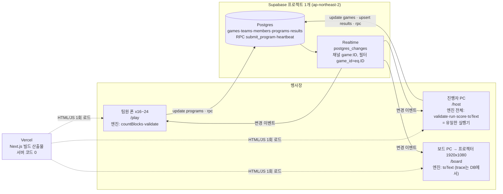
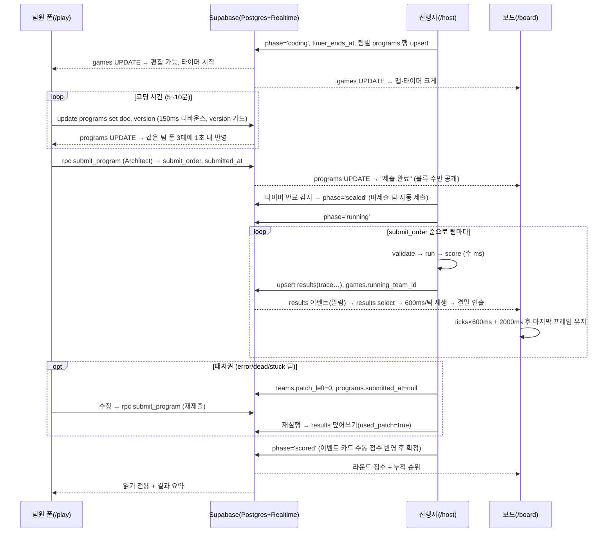

## 1. 개요와 아키텍처

### 1.1 목적과 범위

- OWL COMPILE은 S.OWL 오리엔테이션용 팀 코딩 게임이다. 4명이 한 팀이 되어 각자 맡은 분류의 블록(Runner=이동, Turner=회전, Controller=제어, Architect=함수·잠자기·제출)을 폰에서 조립해 하나의 프로그램을 만들고, 진행자가 "전체 실행"을 누르면 프로젝터에서 부엉이가 8×8 맵을 한 틱씩 움직여 둥지로 간다. 5라운드, 라운드마다 블록 상한과 코딩 시간이 있고 점수는 엔진 `score()`가 계산한다(브리프 §2).
- 브리프(`plan/CLAUDE.md`)가 클라이언트가 준 유일한 스펙이다. 이 설계서는 브리프가 비운 곳을 채우고 구현 순서와 검증 방법을 정한다. 공통 결정은 `docs/DECISIONS.md`, 엔진 의미론은 `docs/ENGINE_SPEC.md`가 기준이며 이 문서는 둘을 반복하지 않고 참조한다.
- 가장 큰 빈칸은 엔진이다. 브리프 §0-1은 "`engine/`은 이미 검증 완료, 수정 금지"라고 전제하지만 인계된 저장소에 `engine/`이 없었다. 그래서 이번 설계에서 `ENGINE_SPEC.md`로 의미론(틱 순서, 점프·문·고양이 규칙, 줄 번호, 점수, 맵 제약)을 확정하고 `engine/`을 직접 구현한다(섹션 02, 맵·정답은 섹션 07). 브리프의 "수정 금지"는 `npx tsx engine/verify.ts`가 전부 통과한 시점부터 적용되고, UI 작업은 그 이후 엔진을 `lib/engine/`으로 복사해 시작한다.
- 브리프의 나머지 빈칸과 담당 섹션: 데이터 모델 보강·동기화 규약(03), 페이즈 상태기계·타이머(04), 폰 편집기 상호작용(05), 진행자·보드 화면(06), 행사 운영·이벤트 카드(08), 장애 대응(09), 테스트(10), 일정(11).
- 범위 밖: 브리프 §7 + DECISIONS §K(로그인, 채팅, 맵 에디터, 팀 시뮬레이터, 리플레이 저장, 테마 전환, CRDT, 오프라인, 다국어).

### 1.2 액터와 기기

| 액터 | 인원 | 기기 | 라우트 | 하는 일 | 호출하는 엔진 함수 |
|---|---|---|---|---|---|
| 팀원(runner/turner/controller/architect) | 4명 × 4~6팀 = 16~24명 | 개인 스마트폰, 세로 390px 기준 | `/` → `/play` | 참가, 자기 역할 블록 삽입, 남의 블록 이동·삭제, architect만 제출 | `countBlocks`, `validate`, `BLOCKS`/`ROLES`, `MAPS` |
| 진행자 | 1명 | 노트북(데스크톱 브라우저) | `/host` | 게임 생성, 페이즈 전이, 타이머, 실행, 패치 허용, 점수 확정 | 전부: `validate`, `run`, `score`, `toText`, `SOLUTIONS` |
| 보드 | 0명(입력 없음) | 프로젝터에 연결된 PC, 1920×1080 전체화면 | `/board` | 로비·타이머·재생·점수판 표시 | `toText`, `MAPS`(trace는 `results`에서 읽음) |

- 동시 클라이언트: 팀원 최대 24 + 진행자 1 + 보드 1 = 26. 예비 폰 교체와 새로고침 중 중복 연결을 더해 30을 설계 상한으로 둔다.
- **[결정]** 보드는 진행자 노트북의 두 번째 브라우저 창(프로젝터 확장 디스플레이)에 띄우는 것을 기본으로 한다. 보드는 DB를 구독만 하므로 별도 PC에서 띄워도 동작이 같다. 어느 쪽이든 보드 창은 F11 전체화면으로 고정한다.
- **[미결]** 행사장에서 프로젝터 PC를 진행자 노트북과 분리할지, 유선 인터넷을 쓸 수 있는지(섹션 08 장비 목록에서 확정).

### 1.3 시스템 구성도



- 서버 애플리케이션은 없다. Vercel은 Next.js가 빌드한 HTML·JS·CSS를 내려주는 역할만 하고, 이후 모든 통신은 각 브라우저와 Supabase 사이에서 직접 일어난다. API 라우트·서버 액션·미들웨어를 만들지 않는다(DECISIONS §B).
- **[결정]** 4개 페이지는 전부 `'use client'` 컴포넌트다. `next.config.ts`의 `output`은 기본값으로 두고(정적 `export` 안 함) Vercel의 기본 Next.js 빌드를 쓴다. 서버 코드 경로가 0이라 결과는 정적 사이트와 같지만, `export` 모드의 제약(리다이렉트·이미지 등)을 떠안을 이유가 없다.
- 엔진 코드는 세 클라이언트에 모두 번들될 수 있지만 호출 범위가 다르다(그림의 "엔진:" 표기, §1.7).

### 1.4 한 라운드의 데이터 흐름



- 모든 화면 전이는 "DB 행 변경 → Realtime 이벤트 → 각 클라이언트 렌더" 순서다. 클라이언트끼리 직접 메시지를 주고받지 않는다(Broadcast·Presence 미사용). 페이즈 전이 세부는 섹션 04, 각 화면의 반응은 섹션 05·06.
- 쓰기 주체 매트릭스. RLS가 전부 허용이므로 이 구분은 코드 규약이다. 진행자 화면만 `games`·`results`를 쓰고, 보드는 아무것도 쓰지 않는다.

| 테이블 | `/play` | `/host` | `/board` |
|---|---|---|---|
| games | 읽기 | 읽기·쓰기(phase, round, timer_*, running_team_id, autoplay) | 읽기 |
| teams | 읽기 | 읽기·쓰기(patch_left) | 읽기 |
| members | insert(참가), rpc heartbeat | 읽기·delete(폰 고장 대응) | 읽기 |
| programs | update doc/version, rpc submit_program | upsert(coding 진입), update submitted_at(봉인 해제), rpc(자동 제출) | 읽기(블록 수만 표시) |
| results | 읽기(결과 요약) | upsert·delete(되돌리기) | 읽기(trace 재생) |

### 1.5 기술 스택과 선택 이유

| 영역 | 선택 | 선택 이유 | 버린 대안 |
|---|---|---|---|
| 프레임워크 | Next.js 15 App Router, TypeScript strict, Tailwind | 브리프 고정. 라우트 4개, 전부 클라이언트 컴포넌트라 App Router의 서버 기능은 쓰지 않고 파일 라우팅과 Vercel 배포 편의만 취한다 | Vite SPA — 브리프 위반 |
| 실시간·DB | Supabase Postgres + Realtime `postgres_changes` | 부하가 작다: 동시 연결 ≤30, 초당 쓰기 ≤20건(폰 24대가 150ms 디바운스로 저장해도 초당 수 건), 행 크기 ≤60KB. 행이 곧 진실이라 새로고침·재접속 복구가 "행 다시 읽기"로 끝난다. 채널 1개 + `game_id` 필터 하나로 모든 화면이 같은 훅(`useGameChannel`)을 쓴다 | 자체 WebSocket 서버 — 운영·배포 부담. Realtime Broadcast — 영속성이 없어 복구 로직을 따로 짜야 함. Presence — `members.last_seen` 하트비트로 충분(DECISIONS §D) |
| 엔진 실행 위치 | 진행자 브라우저(`/host`) | 엔진은 의존성 0·결정적·300틱 상한이라 6팀 순차 실행이 수십 ms다. 진행자가 `results`의 유일한 작성자라 경쟁 조건이 없고, 보드는 `trace`만 재생하므로 진행자 PC가 죽어도 이미 저장된 결과는 그대로다(진행자 복구는 섹션 09) | Edge Function/API 라우트 — 배포·인증 표면만 늘고 이득 없음. 보드에서 실행 — 보드 새로고침 시 결과가 사라지고 작성자가 둘이 됨 |
| 프로그램 동기화 | 낙관적 갱신 + 버전 비교(마지막 저장 승리) | 편집자 4명, 문서는 블록 ≤12개 트리(수 KB), 서로 다른 역할이 다른 블록을 만진다. 충돌은 드물고 충돌해도 "다른 팀원이 먼저 저장했어요" 토스트 후 서버본으로 교체하면 된다(DECISIONS §D) | CRDT(Yjs 등) — 번들 +100KB, 별도 프로바이더, C-블록 입 구조를 CRDT 트리에 매핑하는 복잡도. 이 규모에서 얻는 건 없다 |
| 클라이언트 상태 | zustand 스토어 3개(`useSession`, `useGame`, `useProgram`) | 실시간 캐시를 컴포넌트 밖에서 갱신해야 하고, 엔진 `Block[]`을 그대로 상태로 쓴다(브리프 §2) | Redux — 과함. React Query — 구독형 캐시와 맞지 않음 |
| 드래그앤드롭 | `@dnd-kit/core` + `sortable` | 브리프 고정. 탭-삽입이 기본, DnD는 보조(섹션 05) | — |
| 인증·보안 | 없음. anon key + RLS 전부 허용 | 행사 1회성. 4자리 게임 코드는 라우팅 편의지 보안이 아니다(§1.8) | — |
| 배포 | Vercel + Supabase 프로젝트 1개 | 브리프 고정. 정적 번들만 서빙 | — |

### 1.6 폴더 구조

브리프 §1을 확장한다. 저장소 루트가 곧 Next.js 앱 루트이고, `engine/`(원본)과 `lib/engine/`(복사본)이 공존한다.

```
app/
  layout.tsx              다크 고정 루트, Pretendard CDN <link>, viewport
  globals.css             디자인 토큰(--night --owl --moon 분류색 5) + cards.html의 .blk/.cblk/.mouth/.else/.foot 이식
  page.tsx                참가 (/)
  play/page.tsx           팀 편집기 (폰 390px)
  host/page.tsx           진행자 (데스크톱)
  board/page.tsx          프로젝터 (1920×1080)
components/
  blocks/                 BlockCard, CBlock, Palette, ProgramStack, Cursor, RepeatPicker
  map/                    MapGrid, TileCell, OwlSprite, CatSprite
  board/                  Playback, CodePanel, EventToast, Scoreboard, LobbyView
  host/                   GamePanel, RoundPanel, TimerControls, TeamTable, SolutionsDrawer, EventCardPanel
  ui/                     Button, BottomSheet, Toast
lib/
  engine/                 engine/ 그대로 복사 (수정 금지, verify.ts 포함)
  supabase/
    client.ts             createClient(NEXT_PUBLIC_*) 싱글턴
    types.ts              Database 타입 (Row/Insert/Update)
    queries.ts            스냅샷 조회: loadGameSnapshot(gameId) 등
    mutations.ts          페이즈 전이·프로그램 저장·rpc 래퍼
  store/
    session.ts            useSession (localStorage 미러)
    game.ts               useGame (games/teams/members/programs/results 캐시)
    program.ts            useProgram (doc + 커서 + 로컬 version)
  hooks/
    useGameChannel.ts     채널 1개 + 재연결 백오프 + 스냅샷 재조회
    useServerClock.ts     서버 시각 오프셋 (60초 갱신)
    useHeartbeat.ts       10초 heartbeat
    useTimer.ts           남은 시간 (250ms)
    usePlayback.ts        trace → 현재 프레임 (보드)
  host/
    runRound.ts           진행자 전용: submit_order 순 validate→run→score→results upsert
    phases.ts             페이즈 전이 함수 (섹션 04의 상태기계 구현)
supabase/
  schema.sql              테이블·인덱스·RLS·publication·replica identity
  rpc.sql                 submit_program, heartbeat
engine/                   엔진 원본 (섹션 02·07). npm run verify 대상
scripts/
  sync-engine.mjs         engine/ → lib/engine/ 복사
docs/                     이 설계서
```

- **[결정]** 엔진의 단일 원본은 루트 `engine/`이다. `lib/engine/`은 `npm run sync:engine`(`scripts/sync-engine.mjs`)이 만드는 복사본이며 손으로 고치지 않는다. 수용 기준 1(`npx tsx lib/engine/verify.ts`)은 복사본에서, `npm run verify`는 원본에서 돌려 둘 다 통과해야 한다.
- **[결정]** 엔진 호출을 조립하는 진행자 전용 오케스트레이션(실행 순회, 결과 저장)은 `lib/host/`에 둔다. 이 코드는 게임 규칙을 담지 않고 엔진 함수를 순서대로 부르기만 한다.

### 1.7 엔진 경계 규칙

브리프 §0의 1~3을 아키텍처 원칙으로 다시 쓴다.

1. **UI는 trace만 소비한다.** 보드의 한 프레임은 `results.trace[i]`의 순수 함수다(`Step.owl/cat/opened/eaten/taken/line/message`). 보드는 부엉이 위치를 스스로 계산하지 않는다. 그래서 새로고침 후에도 `running_team_id`와 `results` 행만으로 마지막 프레임을 그대로 복원할 수 있다(DECISIONS §H).
2. **게임 로직은 엔진에 한 번만 있다.** 아래 질문은 반드시 해당 함수로 답한다. 화면에 같은 계산을 다시 쓰면 리뷰에서 반려한다.

| 질문 | 엔진 | 호출 화면 |
|---|---|---|
| 블록이 몇 개인가 | `countBlocks(doc)` | `/play` 카운터, `/host` 팀 표, `/board` 제출 표시 |
| 제출할 수 있는가 | `validate(doc, map)` | `/play` 제출 버튼·팔레트 비활성, `/host` 실행 전 |
| 어떻게 움직이는가 | `run(map, doc)` | `/host`만 |
| 몇 점인가 | `score(result, ctx)` | `/host`만 |
| 코드가 어떻게 읽히는가 | `toText(doc)` | `/board` 코드 패널, `/host` 미리보기 |
| 블록의 라벨·색·역할·틱 | `BLOCKS`, `ROLES`, `BLOCK_ORDER` | 전 화면 |
| 맵·상한·시간 | `MAPS[round]` | 전 화면 |
| 정답 | `SOLUTIONS` | `/host` 정답 보기 토글만 |

3. **팀 화면에 시뮬레이터가 없다.** `/play`는 `run`·`score`·`SOLUTIONS`를 import하지 않고, 맵 미니는 항상 시작 위치의 부엉이만 그린다. **[결정]** 이를 정적으로 강제한다: 각 페이지는 `lib/engine/index.ts` 대신 필요한 모듈만 얕게 import하고(`lib/engine/blocks`, `lib/engine/validate` 등), ESLint `no-restricted-imports`로 `app/page.tsx`·`app/play/**`·`components/blocks/**`에서 `lib/engine/run`, `lib/engine/score`, `lib/engine/solutions`, `lib/engine/index` import를 금지한다. 섹션 10의 검사 항목에 포함한다.
4. **엔진은 순수하다.** `Date`·`Math.random`·DOM·Supabase를 모르고, 같은 입력에 같은 trace를 낸다. 시각·난수·네트워크는 전부 `lib/hooks`·`lib/supabase`에 있다.

### 1.8 비기능 요구

| 항목 | 목표 | 근거·설계 |
|---|---|---|
| 동시 클라이언트 | 30 (정상 26) | 클라이언트당 Realtime 채널 1개, `postgres_changes` 바인딩 4~5개. Supabase 무료 플랜 한도 안에서 여유가 크다 |
| 편집 반영 지연 | 한 폰의 삽입이 같은 팀 다른 폰 3대에 ≤1초(p95), 통상 0.5초 | 디바운스 150ms + 서울 리전 쓰기 왕복 ≤100ms + WAL→Realtime 전파 100~300ms + 렌더 1프레임. 수용 기준 2 |
| 페이즈 전이 반영 | 전 화면 ≤1초 | `games` UPDATE 1건이 26개 클라이언트로 팬아웃 |
| 보드 애니메이션 | 60fps, 6팀×300틱 재생에도 누적 드리프트 <1틱 | 이동·회전은 CSS `transform` 전환(450ms/300ms)만 쓰고 레이아웃 속성은 애니메이션하지 않는다. React 리렌더는 틱당 1회(600ms). 틱 스케줄은 재생 시작 시각 기준 절대 시간으로 계산한다(섹션 06) |
| 엔진 실행 시간 | 팀당 <5ms, 6팀 <50ms | 300틱 상한, 순수 TS |
| 결과 행 크기 | `results.trace` ≤60KB(301 Step × ~200B) | **[결정]** Realtime 이벤트는 "바뀌었다"는 알림으로만 쓰고, 보드·진행자는 `results` 이벤트를 받으면 해당 행을 `select`로 다시 읽는다. 큰 jsonb를 이벤트 페이로드에 의존하지 않아 크기 제한·잘림 문제가 없다 |
| 복구 | 어느 화면이든 새로고침 후 3초 내 현재 상태 복원 | `localStorage` 신원 + `loadGameSnapshot` 전체 재조회 + 채널 재구독(DECISIONS §D) |
| 첫 로드 | `/play` JS ≤250KB gzip, 3G급 Wi-Fi에서 ≤5초 | 엔진 얕은 import, dnd-kit만 외부 의존. Pretendard는 CDN 실패 시 시스템 폰트로 폴백 |
| 브라우저 | **[결정]** 폰: iOS Safari 16+, Android Chrome 최신 2버전. 진행자·보드: Chrome/Edge 최신 데스크톱 | 행사 전 리허설에서 팀원 폰 기종 조사(섹션 08) |
| 보안 수준 | 행사 1회성 | anon key는 번들에 공개되고 RLS는 전부 허용이다. 참가자가 브라우저 콘솔로 DB를 고칠 수 있음을 알고 받아들인다(오리엔테이션 맥락). 완화: 진행자 화면에 "이전 페이즈로"와 팀원 행 삭제가 있고(DECISIONS §F·§I), 행사 종료 후 Supabase 프로젝트를 일시정지하고 anon key를 교체한다 |
| 미지원 | 오프라인, 접근성 특화, 다국어, 라이트 테마 | DECISIONS §K |

### 1.9 배포·환경 구성

- Vercel 프로젝트 1개. Git 저장소 연결, Framework Preset `Next.js`, Node 20, 빌드 명령 기본(`next build`). Production과 Preview에 같은 환경변수 2개를 넣는다. **[결정]** Supabase 프로젝트도 1개를 Production·Preview·로컬이 공용한다. 게임은 `games.code`로 격리되므로 리허설 게임과 실제 게임이 한 DB에 있어도 충돌하지 않는다.
- **[미결]** 참가 URL. `*.vercel.app` 기본 도메인으로 갈지 커스텀 도메인을 붙일지. 보드 로비 화면과 인쇄물의 QR은 이 URL로 만든다(섹션 08).

| 환경변수 | 값 | 비고 |
|---|---|---|
| `NEXT_PUBLIC_SUPABASE_URL` | Supabase 프로젝트 URL | Settings → API |
| `NEXT_PUBLIC_SUPABASE_ANON_KEY` | anon 공개 키 | 번들에 포함됨. 그 외 변수 없음(DECISIONS §B) |

- `package.json` 스크립트: `dev`, `build`, `verify`(원본 엔진), `verify:lib`(복사본 엔진), `sync:engine`, `lint`. `.env.local.example`에 변수 2개를 빈 값으로 둔다.

Supabase 프로젝트 생성 체크리스트:

1. 새 프로젝트 생성. **[결정]** 리전 `ap-northeast-2`(서울) — 행사장에서 왕복 지연이 가장 짧다. DB 비밀번호는 진행자만 보관(앱은 쓰지 않는다).
2. SQL Editor에서 `supabase/schema.sql` 실행 → 테이블 5개, 인덱스 3개(DECISIONS §C), RLS `using (true) with check (true)` 정책, `alter publication supabase_realtime add table …`.
3. **[결정]** `schema.sql`에 `alter table members replica identity full;` `alter table programs replica identity full;` `alter table results replica identity full;` 세 문장을 포함한다. 기본 replica identity로는 DELETE 이벤트에 기본키만 실리므로 `game_id=eq.<id>` 필터가 DELETE(팀원 삭제, 되돌리기 시 결과 삭제)에 걸리지 않는다. 세 테이블은 행이 작아 비용이 없다(섹션 03의 `schema.sql`에 반영).
4. `supabase/rpc.sql` 실행 → `submit_program`, `heartbeat`. `anon` 역할에 `execute` 권한이 있는지 확인한다.
5. Database → Replication에서 `supabase_realtime` publication에 5개 테이블이 모두 켜져 있는지 확인한다.
6. Settings → API에서 URL과 anon key를 복사해 Vercel 환경변수와 로컬 `.env.local`에 넣는다.
7. 배포된 `/host`에서 게임을 하나 만들고 폰 2대로 `/play`에 참가해 편집이 1초 내 오가는지 확인한다(섹션 10 스모크 테스트).
8. 행사 종료 후: 프로젝트 일시정지 또는 삭제, anon key 교체.
