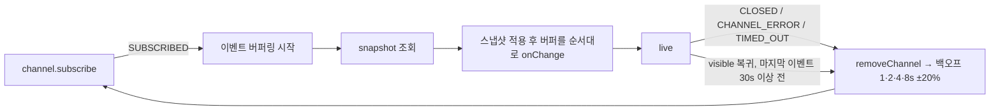
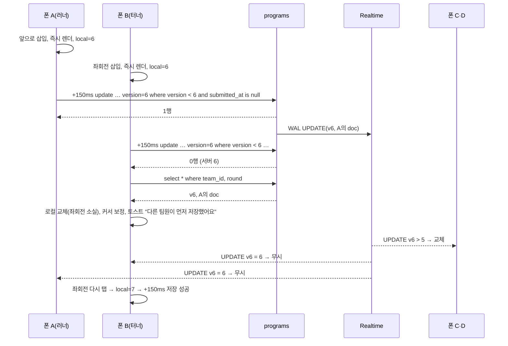

## 3. 데이터 모델과 실시간 동기화

브리프 §4의 스키마에 DECISIONS §C·§D를 합쳐 완성본을 확정한다. 서버는 Supabase Postgres 하나이고 인증이 없으므로, 서버가 지키는 불변식은 세 개로 한정한다 — (1) 라운드 내 `submit_order` 유일, (2) 봉인된 문서 불변, (3) 팀 내 역할 좌석 유일(`unique(team_id, role)`). 나머지 규칙은 전부 클라이언트가 지킨다.

### 3.1 설계 원칙

- 자식 테이블 전부에 `game_id`를 비정규화한다(§C). Realtime 필터가 한 종류로 통일되고, `delete from games` 한 줄로 게임 하나가 통째로 지워진다.
- 프로그램 문서는 `Block[]`을 통째로 저장한다. 부분 패치·CRDT 없음(§K). 저장 1회 = `programs` 행 UPDATE 1건.
- 서버 로직은 RPC 3개와 트리거 1개뿐이다. 블록 수·검증·점수 같은 게임 로직은 SQL에 쓰지 않는다(브리프 §0-2).
- **[결정]** Supabase 프로젝트 리전은 서울(`ap-northeast-2`). 폰→DB 왕복 60~120ms가 수용 기준 2("1초 내 반영") 예산의 근거다.

### 3.2 최종 스키마 SQL

```sql
-- gen_random_uuid()는 Postgres 13+ 내장. 확장 불필요.
create table games (
  id               uuid primary key default gen_random_uuid(),
  code             text not null unique check (code ~ '^[1-9][0-9]{3}$'),
  round            int  not null default 1 check (round between 1 and 5),
  phase            text not null default 'lobby'
                   check (phase in ('lobby','coding','sealed','running','scored','finished')),
  timer_ends_at    timestamptz,
  timer_remaining  int,                          -- §C 일시정지 중 남은 초
  running_team_id  uuid,                         -- FK 없음(순환 참조 회피)
  autoplay         boolean not null default true,-- §C
  created_at       timestamptz not null default now()
);

create table teams (
  id          uuid primary key default gen_random_uuid(),
  game_id     uuid not null references games on delete cascade,
  name        text not null,
  color       text not null,
  patch_left  int  not null default 1 check (patch_left in (0, 1)),
  seat        int  not null,
  unique (game_id, seat)
);

create table members (
  id         uuid primary key default gen_random_uuid(),
  team_id    uuid not null references teams on delete cascade,
  game_id    uuid not null references games on delete cascade,   -- §C
  role       text not null check (role in ('runner','turner','controller','architect')),
  last_seen  timestamptz not null default now(),
  unique (team_id, role)
);
create index members_game_idx on members (game_id);
alter table members replica identity full;      -- DELETE 이벤트가 game_id 필터를 통과하도록

create table programs (                          -- 팀×라운드 라이브 문서
  team_id       uuid not null references teams on delete cascade,
  game_id       uuid not null references games on delete cascade,  -- §C
  round         int  not null check (round between 1 and 5),
  doc           jsonb not null default '[]' check (jsonb_typeof(doc) = 'array'),
  version       int  not null default 0,
  blocks        int  not null default 0,         -- 편집기가 countBlocks(doc)를 함께 기록
  submitted_at  timestamptz,
  submit_order  int,                             -- 1 = 최초 제출
  primary key (team_id, round)
);
create index programs_game_round_idx on programs (game_id, round);
create unique index programs_submit_order_uq
  on programs (game_id, round, submit_order) where submit_order is not null;

create table results (
  team_id      uuid not null references teams on delete cascade,
  game_id      uuid not null references games on delete cascade,   -- §C
  round        int  not null check (round between 1 and 5),
  outcome      text not null check (outcome in ('goal','error','dead','stuck')),
  message      text,
  ticks        int, blocks int, mice int,
  trace        jsonb not null,                   -- Step[]
  used_patch   boolean not null default false,
  score        int  not null,
  score_lines  jsonb not null,                   -- ScoreLine[]
  primary key (team_id, round)
);
create index results_game_round_idx on results (game_id, round);
alter table results replica identity full;      -- 되돌리기(DELETE) 이벤트 필터 통과용

-- RLS: 전부 허용 (브리프 §4, 행사 1회용)
alter table games    enable row level security;
alter table teams    enable row level security;
alter table members  enable row level security;
alter table programs enable row level security;
alter table results  enable row level security;
create policy games_all    on games    for all to anon using (true) with check (true);
create policy teams_all    on teams    for all to anon using (true) with check (true);
create policy members_all  on members  for all to anon using (true) with check (true);
create policy programs_all on programs for all to anon using (true) with check (true);
create policy results_all  on results  for all to anon using (true) with check (true);

alter publication supabase_realtime add table games, teams, members, programs, results;

-- 봉인 보호: 봉인 상태에서 doc이 바뀌는 UPDATE는 거부. 봉인 해제(submitted_at→null)는 통과.
create or replace function programs_guard() returns trigger language plpgsql as $$
begin
  if old.submitted_at is not null and new.submitted_at is not null
     and new.doc is distinct from old.doc then
    raise exception '봉인된 프로그램은 수정할 수 없다' using errcode = 'P0001';
  end if;
  return new;
end $$;
create trigger programs_guard before update on programs
  for each row execute function programs_guard();

-- RPC 1: 제출 (§C). security invoker. p_doc이 null이면 현재 doc 유지(진행자의 자동 제출용).
create or replace function submit_program(p_team uuid, p_round int, p_doc jsonb)
returns programs language plpgsql set search_path = public as $$
declare
  v_game uuid;
  v_row  programs;
begin
  select game_id into v_game from teams where id = p_team;
  if v_game is null then
    raise exception '팀이 없다: %', p_team using errcode = 'P0002';
  end if;

  -- 같은 게임·라운드의 제출을 직렬화. 트랜잭션이 끝나면 자동 해제.
  perform pg_advisory_xact_lock(hashtext(v_game::text || ':' || p_round::text));

  insert into programs (team_id, game_id, round, doc)
  values (p_team, v_game, p_round, coalesce(p_doc, '[]'::jsonb))
  on conflict (team_id, round) do nothing;

  select * into v_row from programs
   where team_id = p_team and round = p_round for update;

  if v_row.submitted_at is not null then
    return v_row;                                -- 멱등: 이미 봉인됨. 아무것도 안 바꾼다.
  end if;

  update programs
     set doc          = coalesce(p_doc, doc),
         version      = version + 1,
         submitted_at = now(),
         submit_order = coalesce(submit_order,   -- 패치 재제출은 기존 순서 유지(§F)
           (select coalesce(max(submit_order), 0) + 1
              from programs where game_id = v_game and round = p_round))
   where team_id = p_team and round = p_round
   returning * into v_row;
  return v_row;
end $$;

-- RPC 2: 하트비트 (§C·§D). false = 진행자가 이 자리를 지웠다.
create or replace function heartbeat(p_member uuid)
returns boolean language plpgsql set search_path = public as $$
begin
  update members set last_seen = now() where id = p_member;
  return found;
end $$;

-- RPC 3: 서버 시각 (§E 오프셋 계산용)
create or replace function server_now() returns timestamptz
language sql stable as $$ select now() $$;

grant execute on function submit_program(uuid, int, jsonb) to anon;
grant execute on function heartbeat(uuid) to anon;
grant execute on function server_now() to anon;
```

브리프 §4·DECISIONS §C에 없는 추가분과 이유:

| 항목 | 이유 |
|---|---|
| **[결정]** `games.code`는 숫자 4자리(1000~9999) | 폰에서 `inputmode="numeric"` 키패드로 입력. 선행 0 혼동 방지 |
| **[결정]** `programs.blocks` | 편집기가 저장마다 `countBlocks(doc)`를 함께 기록한다. 보드·진행자는 엔진 호출 없이 이 값을 읽는다(§B "보드는 toText만" 유지) |
| **[결정]** `members`·`results` `replica identity full` | 기본 identity에서는 DELETE 이벤트의 old 행에 PK만 실려 `game_id` 필터를 통과하지 못한다. 진행자의 팀원 삭제(§I)와 되돌리기의 `results` 삭제(§F)를 실시간으로 받으려면 필수 |
| **[결정]** `programs_submit_order_uq` 부분 유니크 | advisory lock의 백스톱. 같은 순번이 두 번 생기면 커밋이 실패한다 |
| **[결정]** `programs_guard` 트리거 | 봉인 직후 늦게 도착한 편집 UPDATE를 서버가 거부한다(§3.5) |
| **[결정]** `submit_program`의 `p_doc null` | 진행자의 봉인 시 자동 제출(§F)은 `null`을 넘겨 서버의 현재 doc을 그대로 봉인한다. 진행자 캐시가 마지막 편집보다 늦어도 덮어쓰지 않는다 |
| **[결정]** `server_now()` RPC | §E의 `select now()`는 PostgREST로 직접 보낼 수 없다. RPC 3개가 된다(§C의 "2개"에 추가) |
| check 제약(phase·role·outcome·round) | 클라이언트 오타를 DB에서 막는다. 비용 없음 |

### 3.3 테이블별 역할과 읽기/쓰기 화면

| 테이블 | 역할 | 쓰는 화면 | 읽는 화면 |
|---|---|---|---|
| `games` | 행사 1회 = 행 1개. 페이즈·라운드·타이머·재생 중인 팀 | `/host`(생성, 페이즈 전이, 타이머, `running_team_id`) | `/play` `/board` `/host` |
| `teams` | 팀 4~6. 이름·색·좌석·패치권 | `/host`(생성, 패치 허용 시 `patch_left=0`) | 전부 |
| `members` | 참가자 = 역할 좌석 1개. 접속 시각 | `/`(insert), `/play`(`heartbeat`), `/host`(delete) | `/play`(팀원 상태) `/host`(접속 인원) `/board`(lobby) |
| `programs` | 팀×라운드 라이브 문서 + 제출 메타 | `/host`(coding 진입 upsert, 패치 허용 시 `submitted_at=null`), `/play`(doc UPDATE, `submit_program`) | `/play` `/host`(블록 수·제출 시각·`toText` 미리보기) `/board`(coding: 제출 완료·블록 수, running: 코드 패널) |
| `results` | 실행 결과·trace·점수 | `/host`(upsert, 이벤트 카드 점수 반영, 되돌리기 delete) | `/board`(재생·점수판) `/host`(팀 표) |

### 3.4 Realtime 구독 설계

- 채널: 클라이언트당 1개, 이름 `game:<gameId>`. Broadcast·Presence는 쓰지 않는다(접속 표시는 §3.8).
- 바인딩: 테이블당 `.on('postgres_changes', { event: '*', schema: 'public', table, filter })` 1개. `games`만 `id=eq.<gameId>`, 나머지는 `game_id=eq.<gameId>`.

| 테이블 · 필터 | `/play` | `/host` | `/board` |
|---|---|---|---|
| `games` · `id=eq` | phase·round·timer_*·running_team_id | 전부 | 전부 |
| `teams` · `game_id=eq` | `patch_left`(패치 허용 표시) | 전부 | 색·이름 |
| `members` · `game_id=eq` | 팀원 접속 상태, 내 행 DELETE 감지 | 접속 인원 | lobby 접속 인원 |
| `programs` · `game_id=eq` | `team_id`가 내 팀이 아니면 버린다 | 블록 수·제출·미리보기 | 제출 완료·블록 수·running 코드 패널 |
| `results` · `game_id=eq` | 구독 안 함 | 결과·점수 | 재생 시작·점수판 |

훅 계약(모든 화면 공통, `lib/realtime/useGameChannel.ts`):

```ts
type Table = 'games' | 'teams' | 'members' | 'programs' | 'results';
type ChannelStatus = 'idle' | 'connecting' | 'live' | 'reconnecting';
interface ChangeEvent { table: Table; type: 'INSERT' | 'UPDATE' | 'DELETE';
                        new: Record<string, unknown> | null; old: Record<string, unknown> | null; commitTs: string }

export function useGameChannel(gameId: string | null, opts: {
  tables: Table[];                      // 위 표의 화면별 테이블
  snapshot: () => Promise<void>;        // 전체 스냅샷 재조회. 결과를 스토어에 직접 반영
  onChange: (e: ChangeEvent) => void;   // 이벤트 1건 → 스토어 반영
}): { status: ChannelStatus; attempt: number; lastEventAt: number | null }
```



- 스냅샷을 구독 **뒤에** 조회하고, 조회 중 도착한 이벤트는 버퍼에 쌓았다가 재적용한다. 버퍼의 마지막 이벤트가 항상 스냅샷보다 같거나 새롭기 때문에 최종 상태가 맞다. `programs`는 버전 비교로 멱등하다.
- **[결정]** `visibilitychange`로 화면이 돌아왔을 때 30초 이상 공백이면 강제 재구독한다. iOS Safari는 백그라운드에서 WebSocket을 조용히 끊는다.
- 스토어 반영 규칙: `games/teams/members/results`는 PK 기준 upsert, DELETE는 제거. `programs`만 §3.5의 버전 규칙.

스냅샷 쿼리(전부 `game_id` 인덱스를 탄다):

| 화면 | 쿼리 |
|---|---|
| 공통 | `games where id`, `teams where game_id order by seat`, `members where game_id` |
| `/play` | `programs where team_id=<mine> and round=<games.round>`. 0행이면 `insert … on conflict do nothing` 후 재조회(진행자의 upsert와 순서 무관하게 동작) |
| `/host` | `programs where game_id and round`, `results where game_id` — **trace 제외** 컬럼 투영(진행자는 trace를 읽지 않는다) |
| `/board` | `programs where game_id and round`, `results where game_id and round=<현재>`(trace 포함) + 이전 라운드는 `team_id, round, outcome, ticks, score`만 |

### 3.5 프로그램 문서 동기화 프로토콜

DECISIONS §D의 5단계를 두 폰이 150ms 안에 동시에 편집하는 경우로 그린다. 서버 `version=5`, 네 폰 모두 로컬 5에서 시작한다.



클라이언트 저장문은 supabase-js로 이렇게 고정한다. `.select()`가 없으면 영향 행 수를 알 수 없다.

```ts
const { data, error } = await supabase.from('programs')
  .update({ doc, version: v, blocks: countBlocks(doc) })
  .eq('team_id', teamId).eq('round', round)
  .lt('version', v).is('submitted_at', null)
  .select('version, submitted_at, submit_order');
if (error || data.length === 0) await refetchAndReplace();   // 서버 승리
```

규칙(§D 보강):

| 상황 | 동작 |
|---|---|
| 탭 여러 번이 150ms 안에 겹침 | 로컬 version은 탭마다 +1, UPDATE는 마지막 값 하나로 나간다(5→8처럼 건너뛰어도 된다) |
| UPDATE 0행 또는 `P0001`(봉인 트리거) | `select`로 서버 행을 읽어 **버전이 같아도** 로컬을 교체한다. 자기 편집이 사라진 걸 화면으로 보여주는 것이 토스트의 역할 |
| Realtime UPDATE 수신 | `doc`·`version`은 `payload.version > local.version`일 때만 교체. **[결정]** `submitted_at`·`submit_order`·`blocks`는 버전 비교 없이 항상 반영(봉인 표시가 늦지 않도록) |
| `submit_program`이 `version+1` | 다른 폰의 미저장 편집은 다음 UPDATE에서 0행 → 재조회 → 봉인 doc으로 교체된다 |
| **[결정]** 재구독 후 스냅샷 | 로컬 version이 더 커도 **무조건** 서버 것으로 교체하고 미저장 편집은 버린다. 토스트 "연결이 끊긴 동안의 편집은 취소됐어요". 오프라인 폰이 복귀하며 팀 문서를 통째로 덮어쓰는 사고를 막는다 |
| `status !== 'live'` | 디바운스 타이머를 세우지 않는다. 편집은 되지만 저장은 복귀 후 스냅샷에 진다 |
| 편집 가능 조건 | `submitted_at === null && phase ∈ {coding, running}`. `running`에서 null인 경우는 패치 허용(§F)뿐이다 |
| 다른 팀 `programs` 이벤트 | `team_id !== myTeamId`면 버린다(필터는 `game_id`) |

커서 보정(§D-5)과 되돌리기 토스트(§G)는 §05가 정한다. 되돌리기도 "삭제 전 스냅샷을 doc으로 놓고 version+1"이라 같은 경로를 탄다.

지연 예산(수용 기준 2): 디바운스 150ms + UPDATE 왕복 ~100ms + WAL→Realtime 전달 100~300ms + 렌더 1프레임 = **0.35~0.6초**.

### 3.6 문서 크기와 페이로드

`Block.uid`는 엔진이 무시하는 편집기용 키다(ENGINE_SPEC §2). **[결정]** `uid`는 6자 base36 난수이고 doc에 저장한다. 폰끼리 dnd-kit 키와 React 키가 안정되어 다른 사람의 삽입이 내 화면에서 깜빡이지 않는다.

```json
[{"id":"repeat","n":4,"uid":"k3x9qa","body":[
  {"id":"repeat","n":5,"uid":"m2p7fd","body":[
    {"id":"if_wall","uid":"z8c1tw",
     "then":[{"id":"right","uid":"h5n2vb"}],
     "else":[{"id":"forward","uid":"q0d6yr"}]}]}]}]
```

| 대상 | 바이트 |
|---|---|
| R3 정답 5블록(위) | 205 B (uid 없이 130 B) |
| 12블록, 함수+반복+조건 혼합 | ~405 B |
| 12블록, 앞으로만 나열 | ~385 B |
| `programs` 행 전체 | ~0.6 KB → Realtime 페이로드(new+old+메타) ~0.8 KB |
| `members` 행(identity full, new+old) | ~0.55 KB |
| `Step` 1개 | 180~210 B |
| `results.trace` 37틱(R5 정답) | ~7.9 KB, 행 전체 ~8.3 KB |
| `trace` 300틱(시간 초과 최악) | ~59 KB — Realtime 메시지 한도(무료 250 KB) 이내 |

### 3.7 제출의 원자성

- 경쟁 조건: 두 팀의 Architect가 같은 초에 제출하면 READ COMMITTED에서 두 트랜잭션이 모두 `max(submit_order)=0`을 읽고 둘 다 1번이 된다. "최초 제출 +10"이 두 팀에 붙는다.
- 해결: `pg_advisory_xact_lock(hashtext(game_id||':'||round))`. 같은 게임·라운드의 제출은 한 줄로 서고, 두 번째 트랜잭션은 첫 번째가 커밋한 뒤 `max=1`을 본다. `select … for update`로 그 라운드의 행 전부를 잠그는 방법은 다른 팀의 편집 UPDATE까지 대기시키므로 쓰지 않는다. 락은 행을 건드리지 않고 키 하나만 잡는다.
- 멱등: 더블 탭, 타임아웃 뒤 재시도, 봉인 후의 자동 제출 중복 호출은 전부 기존 행을 그대로 돌려준다. `submit_order`는 두 번 매겨지지 않고, 패치 재제출은 `coalesce(submit_order, …)`로 원래 순번을 유지한다.
- `firstSubmit`(ScoreContext) = `submit_order === 1`. 진행자가 `score()`를 부를 때 그대로 넘긴다.
- Architect의 제출 절차: 디바운스 취소 → 즉시 저장(`doc, version, blocks`) → 0행이면 재조회 후 중단("문서가 바뀌었어요, 다시 확인해 주세요") → `validate` 통과 확인 → `submit_program(teamId, round, doc)` → 응답 행으로 스토어 교체. 이 순서 덕에 `blocks` 컬럼과 봉인된 `doc`이 항상 일치한다.

### 3.8 하트비트와 접속 표시

| 규칙 | 값 |
|---|---|
| 호출 | `/play` 마운트 즉시 1회, 이후 `setInterval` 10초. `visibilitychange`→visible 시 즉시 1회 추가 |
| 온라인 판정 | `serverNow − last_seen < 25초`. `serverNow = Date.now() + offset`(§E). 판정은 members 이벤트 수신 시 + 5초 주기 재계산 |
| 표시 | `/play` 하단 역할 4칸: 온라인 = 분류색 점, 오프라인 = 회색 점 + "오프라인". `/host` 팀 표 "온라인 수/4", `/board` lobby 동일 |
| `heartbeat()`가 `false` | 내 `members` 행이 삭제됨 → `owl.session` 삭제 → `/`로 이동, 토스트 "진행자가 자리를 초기화했어요. 다시 참가해 주세요". Realtime DELETE 이벤트가 먼저 오면 같은 처리 |
| 진행자·보드 | member 행이 없으므로 하트비트를 보내지 않는다 |
| 백그라운드 | 인터벌은 유지하되 OS가 30초 이상으로 늦출 수 있다 → 잠깐 "오프라인"으로 보였다가 복귀 시 즉시 회복. 대응은 §09 |

### 3.9 새로고침 복귀 (localStorage)

```ts
// key 'owl.session'
interface OwlSessionV1 {
  v: 1;
  gameId: string;    // games.id
  gameCode: string;  // games.code — 헤더 표시·재참가 프리필
  teamId: string;    // teams.id
  memberId: string;  // members.id — 복귀의 유일한 근거
  role: 'runner' | 'turner' | 'controller' | 'architect';
  savedAt: number;   // Date.now()
}
```

- `/play` 마운트: 키 없음 → `/`. 있음 → `select id, team_id, game_id, role from members where id`. 0행 → 키 삭제 + `/`(§I). 1행 → 행의 값으로 스토어를 채운다(저장값보다 행을 믿는다) → `useGameChannel` 시작.
- **[결정]** `v`가 1이 아니거나 `savedAt`이 24시간 이전이면 키를 버린다. 다음 행사에서 낡은 세션이 되살아나는 것을 막는다.
- **[결정]** `/`에서 유효한 키가 있으면 "이어서 참가 — 수리부엉이 · Turner" 버튼을 먼저 보여준다(§05).
- **[결정]** 진행자는 `owl.host` = `{ v: 1, gameId, code }`로 복귀하고, 보드는 `/board?code=4821`처럼 URL이 상태다(북마크·새로고침에 강함). 자세한 화면 흐름은 §06.
- 시각 오프셋(§E)은 저장하지 않는다. 로드마다 `server_now()`로 다시 잰다.

### 3.10 데이터 수명

개인정보가 없다(이름·이메일·기기 식별자 컬럼 없음). 그래도 행사 뒤에 지운다.

```sql
-- 1) 보관이 필요하면 먼저 뽑는다 (SQL Editor → CSV 다운로드)
select g.code, t.seat, t.name, r.round, r.outcome, r.ticks, r.blocks, r.mice, r.used_patch, r.score
  from results r join teams t on t.id = r.team_id join games g on g.id = r.game_id
 order by g.code, r.round, t.seat;

-- 2) 게임 1건 삭제 (teams/members/programs/results는 cascade)
delete from games where code = '4821';

-- 3) 리허설 포함, 7일 지난 게임 일괄 삭제
delete from games where created_at < now() - interval '7 days';
```

- **[결정]** 보존 기간 7일. 삭제되면 `code`를 다시 쓸 수 있다(진행자의 코드 생성은 unique 충돌 시 재시도).
- **[미결]** 결과를 동아리 기록(후기 게시글 등)으로 남길지. 남기면 2)보다 1)을 먼저 실행한다.

### 3.11 부하 추정

가정: 6팀×4명 + 진행자 + 보드 = **26 클라이언트**. 하트비트 24폰/10초 = 2.4 UPDATE/s(모든 페이즈). 편집은 활발할 때 팀원 1명이 2초에 1탭 → 팀당 2 UPDATE/s, 6팀 **피크 12/s**, 평균은 그 1/6 ≈ 2/s. Realtime 메시지 수 = DB 변경 1건 × 수신 클라이언트 수(Supabase 과금·한도 계산 방식).

| 항목 | 변경/s | §D 그대로(수신 26) | 개정안 수신자 | 개정안 메시지/s |
|---|---|---|---|---|
| 하트비트 | 2.4 | **62** | 팀원 4 + 진행자 + 보드 = 6 | 14 |
| 편집 평균 | 2 | 52 | 6 | 12 |
| 편집 피크 | 12 | 312 | 6 | 72 |
| 합계 평균 / 피크 | | **~114 / ~374** | | **~26 / ~86** |

- 무료 요금제 기본 한도(공개 문서 기준, 대시보드 Realtime 설정에서 재확인): 동시 접속 200, **초당 메시지 100**, 월 200만 건, 메시지 최대 250 KB. 접속 수(26)와 월 건수(2시간 × 114/s ≈ 82만)는 넉넉하지만, **§D의 `game_id` 단일 필터로는 하트비트만으로 초당 한도의 62%를 쓰고 평균 편집만 더해도 100/s를 넘는다.** 4팀이면 하트비트 29/s + 편집 평균 24/s로 간신히 들어온다.
- **[미결]** 개정안: `/play`의 `programs`·`members` 구독 필터만 `team_id=eq.<teamId>`로 바꾼다(진행자·보드는 `game_id` 유지). DECISIONS §D "팀 편집기 … 필터는 game_id" 문구의 수정이 필요하므로 여기서 확정하지 않는다. 채택하면 피크 86/s로 한도 안에 들고 대역폭도 피크 ~340 KB/s → ~80 KB/s로 준다. 채택하지 않으면 Pro 요금제(500/s) 또는 4팀 제한이 필요하다.
- Postgres: 피크 ~15 UPDATE/s, 행 1 KB 이하. 무료 인스턴스로 충분하다. 저장 용량은 `results` 30행 × 8 KB 등 게임당 1 MB 미만.
- 재연결 폭풍: 행사장 Wi-Fi가 끊겼다 돌아오면 24폰이 동시에 재구독 + 스냅샷 5쿼리 = 약 120쿼리가 수 초에 몰린다. 백오프 지터 ±20%로 퍼지고, 조인 한도(100/s)에도 여유가 있다.
