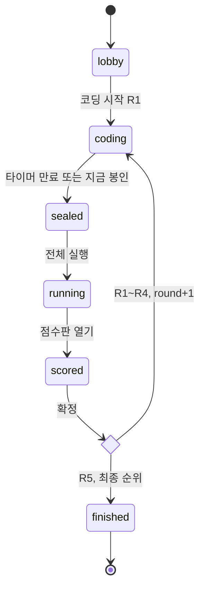
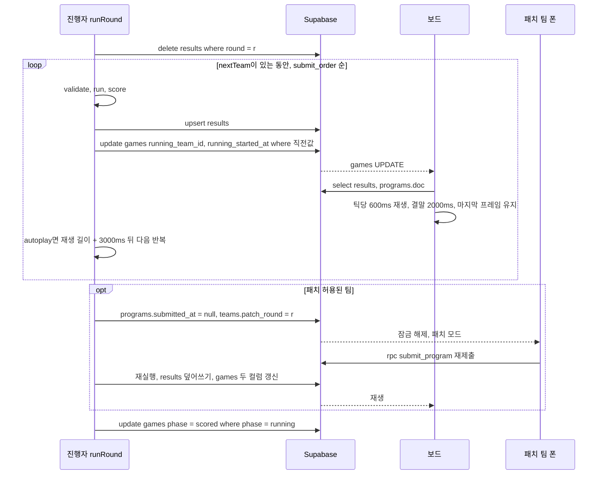

## 4. 페이즈 상태기계와 진행 흐름

페이즈는 진행자 화면(`/host`)만 바꾼다(DECISIONS §F). 구현은 `lib/host/phases.ts`(전이 함수)와 `lib/host/runRound.ts`(실행 순회)이고, 버튼 라벨과 활성 조건은 섹션 06 §6.4를 따른다. 이 섹션은 전이마다 무엇을 어떤 순서로 쓰는지, 중간에 끊기면 어떻게 이어지는지를 정한다.

### 4.1 상태기계와 전이표



- 역방향 전이는 `이전 페이즈로` 하나뿐이라 그림에서 뺐다(§4.8).
- 페이즈를 바꾸는 쓰기는 `games` 행 1건의 조건부 UPDATE다(§4.10). `programs`·`results`·`teams` 부수효과는 모두 멱등이다.

| 전이 | 트리거 | 선행 조건 | 부수효과(쓰기 순서) | 실패 시 복구 |
|---|---|---|---|---|
| lobby→coding | `코딩 시작 (R1)` | 없음. architect가 없는 팀은 경고만 | ① `programs` 전 팀 upsert ② `games` phase·시계(§4.2) | ①은 멱등이라 다시 누른다. `/play`는 행이 없으면 직접 insert한다(§3.4) |
| coding→sealed | 만료 시 자동 / `지금 봉인` | phase=coding | ① `games` phase, 시계 정지 ② 미제출 팀 자동 제출(§4.4) | sealed를 본 진행자 탭이 `ensureSealed()`를 다시 돈다 |
| sealed→running | `전체 실행` | 전 팀 `submitted_at≠null` | ① 그 라운드 `results` delete ② 첫 팀 결과 upsert ③ `games` phase·`running_team_id`·`running_started_at`(§4.5) | ③ 전에 끊기면 페이즈가 여전히 sealed라 다시 누른다 |
| running 안에서 다음 팀 | autoplay 타이머 / `다음 팀` | 정규 대기 팀 있음 | 결과 upsert 후 `games` 두 컬럼 | 로드할 때 `deriveHostState`가 다시 예약한다(§4.9) |
| running→scored | `점수판 열기` | 전 팀 결과 있음, 재생 끝남, 진행 중 패치 없음 | `games.phase` | — |
| scored→coding | `다음 라운드 (R{n+1})` | round<5 | lobby→coding과 같고 `round=r+1`, `running_team_id`·`running_started_at`·`spotlight_team_id`=null | 같음 |
| scored→finished | `최종 순위` | round=5 | `games.phase` | — |

### 4.2 라운드 시작 절차

1. `programs` upsert: 팀마다 `{team_id, game_id, round: r, doc: [], version: 0}`, 옵션 `{ onConflict: 'team_id,round', ignoreDuplicates: true }`. 이미 있는 행은 건드리지 않으므로 되돌리기 뒤 재진입해도 편집 내용이 남고, `/play`가 먼저 insert한 경우와 순서가 겹쳐도 문제없다.
2. `games` update: `phase='coding'`, `round=r`, `timer_ends_at = serverNow() + MAPS[r].seconds×1000`, `timer_remaining=null`, 조건은 `phase=직전값 ∧ round=직전값`.
- **[결정]** `timer_ends_at`은 진행자가 `serverNow()`로 계산해 넣는다. supabase-js update로는 SQL `now()`를 쓸 수 없고, 오프셋 오차(왕복의 절반, 50ms 안팎)는 초 단위 표시에 드러나지 않는다. 전이용 RPC는 만들지 않는다.
- 진입하는 순간 타이머가 흐른다(DECISIONS §F). "새 요소" 멘트(§8.2) 시간을 따로 빼려면 진행자가 곧바로 `일시정지`를 누른다.
- 팀 화면은 editing 모드, 커서 `[doc.length]`(§5.5). 보드는 맵과 타이머를 띄운다.

### 4.3 타이머 규칙

| 항목 | 규칙 |
|---|---|
| 서버 시각 | `useServerClock`이 로드 때와 60초마다 `rpc('server_now')`를 호출한다. **[결정]** `offset = server − (t0+t1)/2`(요청 전후 로컬 시각의 중간값)로 계산하고, 왕복이 1초를 넘는 표본은 버린다. `serverNow() = Date.now() + offset` |
| 남은 시간 | `timer_ends_at − serverNow()`, `useTimer`가 250ms마다 갱신. `timer_ends_at`이 null이면 `timer_remaining` 고정 표시 |
| 만료 감지 | 진행자 화면만 한다. `phase=coding ∧ timer_ends_at≠null ∧ 남은 시간≤0`이면 `sealRound({auto: true})`. 탭 안의 중복 호출은 로컬 플래그로, 탭 사이 중복은 조건부 update로 막는다 |
| 팀·보드 | 00:00에서 멈춘다. `/play`는 timeout 모드("시간 종료 · 봉인 대기", 읽기 전용)로만 바뀌고 페이즈를 바꾸지 않는다 |
| `+30초` | 흐르는 중: `timer_ends_at = 현재값+30s where timer_ends_at = 현재값`. 일시정지 중: `timer_remaining + 30 where timer_remaining = 현재값`. 더블클릭해도 60초가 되지 않는다 |
| `일시정지` | `timer_remaining = ceil((timer_ends_at − serverNow())/1000)`, `timer_ends_at = null`, 조건 `timer_ends_at is not null` |
| `재개` | `timer_ends_at = serverNow() + timer_remaining×1000`, `timer_remaining = null`, 조건 `timer_ends_at is null` |
| 숨은 탭 | 브라우저는 가려진 탭의 타이머를 늦춘다(Chrome은 5분 뒤 분 단위). 진행자 창은 가리지 않는다. `visibilitychange`로 창이 다시 보이면 만료 검사를 즉시 한 번 더 한다 |

진행자가 없으면 봉인도 없다. 팀 화면은 timeout 모드로 기다리고, 진행자 화면이 로드되면 첫 검사에서 봉인된다(§4.9).

### 4.4 봉인 절차

1. `games` update: `phase='sealed'`. **[결정]** 이때 `timer_ends_at`을 봉인 시각(`serverNow()`)으로 덮어쓰고 `timer_remaining`에 봉인 시점의 남은 초(0 이상, 일시정지 중이었으면 그 값)를 넣는다. 컬럼을 늘리지 않고 (a) 모든 화면이 00:00으로 맞고 (b) `submitted_at ≥ timer_ends_at`인 행 = 자동 제출(섹션 06 팀 표 `자동 제출`의 판정식)이 되며 (c) 되돌리기 때 남은 시간을 복원할 수 있다.
2. `ensureSealed()`: `submitted_at is null`인 팀을 `seat` 순으로 **하나씩 차례로** `rpc('submit_program', {p_team, p_round, p_doc: null})`. `p_doc` null은 서버에 있는 현재 doc을 그대로 봉인한다는 뜻이다(§3.2). **[결정]** 자동 제출 순번은 수동 제출 순번 뒤에 seat 순으로 붙는다. 수동 제출이 하나도 없으면 첫 자동 제출 팀이 +10을 받는데, DECISIONS §F대로 그대로 둔다.
3. 늦게 도착한 편집: 봉인 전에 도착한 저장은 봉인본에 들어가고, 봉인 뒤 도착분은 `programs_guard`가 거부한다(P0001). 그러면 `/play`가 다시 조회해 봉인본을 보여 준다. 00:00 경계에서 들어온 수동 제출은 서버가 phase를 보지 않으므로 수동 제출로 인정된다.
4. 상한 초과, 빈 문서, def 규칙 위반 문서도 그대로 봉인한다. 실행할 때 `validate`가 걸러 컴파일 에러 결과로 기록한다(§4.5).

### 4.5 실행 절차

- **[결정]** 대기열을 메모리에 들고 있지 않고 매번 DB에서 계산한다. `nextTeam(snapshot)` = 그 라운드에 `results` 행이 없는 팀 중 `submit_order`가 가장 작은 팀. 없으면 정규 순서가 끝난 것이다.
- 결과 계산(`runRound.ts`의 `computeResult`):

```ts
const map = MAPS[round], v = validate(p.doc, map);
const base = run(map, v.ok ? p.doc : []);   // 빈 프로그램 = 0틱, trace = [초기 프레임]
const res: RunResult = v.ok ? base : { ...base, outcome: 'error', blocks: v.blocks,
  message: `컴파일 에러: ${v.errors.join(' · ')}` };
const s = score(res, { cap: map.cap, firstSubmit: p.submit_order === 1, usedPatch });
const keep = prev?.score_lines.filter(l => l.label.startsWith('이벤트: ')) ?? [];   // §6.6
// upsert → score: max(0, s.total + Σkeep.points), score_lines: [...s.lines, ...keep]
```

- **[결정]** 컴파일 에러일 때 초기 프레임은 `run(map, [])`에서 가져온다. UI가 부엉이 시작 상태를 직접 만들지 않는다(브리프 §0-2). 점수는 `score()`의 error 규칙을 그대로 따라 max(0, 40−5d)에 최초 제출 점수를 더한다.
- 쓰기 순서: `results` upsert → `games` update(`running_team_id`, `running_started_at = serverNow()`). 조건은 `running_started_at = 직전값`이고, 첫 팀만 `phase='sealed'` 조건과 함께 `phase='running'`을 같이 쓴다. 보드가 `games` 이벤트를 받고 `results`를 읽으므로 이 순서를 지킨다(§6.9, `running_started_at`은 섹션 06이 추가한 컬럼).
- 재생 시간: `playbackDuration(ticks) = ticks×600 + 2000`ms(DECISIONS §F). 120틱을 넘는 부분은 틱당 150ms로 줄인다(섹션 11 위험 5). 진행자와 보드가 `lib/hooks/usePlayback.ts`의 같은 함수를 쓴다. 예: R3 정답 20틱은 14.0초, 컴파일 에러는 2.0초, 300틱은 101초.
- autoplay: 재생이 시작되면 `startedAt + playbackDuration + 3000 − serverNow()` 뒤에 `runNext`를 예약한다. 정규 대기 팀이 있을 때만 예약하고, 체크박스를 끄면 `games.autoplay=false`로 쓰고 예약을 취소한다.
- `다음 팀`: 누르면 곧바로 `runNext`. 재생 중이면 "건너뛰기" 확인을 거친다(§6.7). 건너뛴 팀의 결과는 남는다.
- 마지막 프레임: 보드는 `running_started_at`이 바뀔 때까지 마지막 프레임과 점수 카드를 유지한다(정규 순서가 끝난 뒤에도).



### 4.6 패치권 절차

| 단계 | 주체 | 조건과 쓰기 | 화면 |
|---|---|---|---|
| 노출 | 진행자 | phase=running, 그 팀 결과 `outcome∈{error,dead,stuck}`, `patch_left=1`, 그 팀 재생 끝남 | TeamDetail `패치 허용` |
| 허용 | 진행자 | "허용" 확인 → ① `programs.submitted_at=null`(`submit_order`는 유지) ② `teams.patch_left=0, patch_round=r`, 조건 `patch_left=1` | 팀 표 `패치 중` |
| 잠금 해제 | 팀 폰 | programs UPDATE 수신 → phase=running이고 `submitted_at` null이면 patching 모드, 배너 "패치 모드 · 블록 1개만 · −10점" | 그 팀 폰만 풀린다. 다른 팀은 봉인된 채로 있다 |
| 재제출 | Architect | `재제출 (−10점)` → `submit_program(team, r, doc)`. `coalesce`라서 원래 `submit_order`가 유지된다(§3.2) | 팀 표 `재실행 대기` |
| 재실행 | 진행자 | `patch_round=r`, `submitted_at≠null`, `used_patch=false`, 정규 순서 끝남, 재생 끝남 → 확인 → `computeResult(team, true)` → `results` 덮어쓰기 → `games` 두 컬럼 갱신 | 보드에서 재생 |
| 점수 반영 | 엔진 | `score()`가 `패치권 사용 −10` 줄을 붙인다. dead면 0 아래로 내려가지 않는다. 이벤트 줄은 다시 붙인다 | 점수 카드 |
| 취소 **[결정]** | 진행자 | 재제출 전에만 `패치 취소`: `submit_program(null)`로 다시 봉인 → `patch_left=1, patch_round=null` | 원래 결과 유지 |

- **[결정]** `teams.patch_round int`를 추가한다(섹션 03 스키마에 반영). `patch_left=0`만으로는 "앞 라운드에서 패치를 쓴 팀"과 "이번 라운드에 재실행을 기다리는 팀"이 구분되지 않아서 섹션 06 §6.4의 `재실행` 조건이 모호해진다. 그 조건은 위 표의 식으로 바꾼다. 되돌리기 때 패치권을 돌려주는 것(§4.8)도 이 컬럼을 보고 한다.
- 봉인 해제 → 차감 순서인 이유: 중간에 끊겨 남는 "running ∧ `submitted_at` null ∧ `patch_round≠r`"은 패치 외에는 생기지 않는 상태라 진행자 로드 때 차감을 마저 한다(§4.9). 거꾸로 하면 `재실행 대기`와 구별되지 않는다.
- 패치를 허용해도 재생은 계속된다(섹션 08). 재실행은 정규 순서가 끝난 뒤 수동으로만 한다(덮어쓰기 확인 때문에 autoplay에 맡기지 않는다). 재제출할 사람이 없으면 `패치 취소`.
- 블록 1개 제한은 코드로 막지 않는다(브리프 §2). **[결정]** 진행자 탭은 허용하는 순간의 `toText(doc)`를 메모리에 두고, TeamDetail에서 지금 코드 미리보기와 나란히 보여 준다. 새로고침하면 사라지는 판정 보조다.
- **[결정]** 보드는 `running_started_at`이 바뀔 때 그 팀의 doc을 한 번만 읽어 코드 패널에 고정한다. 패치 중 편집이 표시 중인 코드와 줄 하이라이트를 흔들지 않게 한다.
- **[미결]** 무엇을 "블록 1개 변경"으로 볼지(삽입·삭제·교체·이동·반복 N 변경 각각). 규칙 카드(§8.7) 문구와 함께 클럽이 정한다.
- 수용 기준 5의 흐름: 18틱 dead 0점 → 허용 → 잠자기 삽입 → 재제출 → 재실행 → 37틱 goal 135점(`firstSubmit=false`).

### 4.7 점수 확정과 순위

- `점수판 열기`는 전 팀에 결과가 있고, 마지막 재생이 끝났고, `패치 중`·`재실행 대기`인 팀이 없을 때만 켜진다. 확인 문구는 "이후 패치 불가".
- scored 동안 `results`를 바꾸는 것은 이벤트 점수 `반영`(§6.6)뿐이다. 확정 컬럼은 없고, `다음 라운드`/`최종 순위`로 페이즈가 scored를 벗어나는 것이 곧 확정이다.
- 누적 점수는 라운드별 `results.score`의 합이다. `rankTeams(teams, results)`(`lib/ranking.ts`, §6.11)는 ① 누적 점수 높은 순 ② goal 라운드 수 많은 순 ③ 총 틱(모든 라운드 `ticks` 합) 적은 순으로 정렬한다. 셋이 모두 같으면 공동 순위이고, **[결정]** 표기는 1·1·3처럼 다음 순위를 건너뛴다.
- finished: `최종 순위`를 누르면 `phase='finished'`가 되고 round는 5로 남는다. 이후로는 아무것도 쓰지 않는다. 보드는 전체 폭 순위, `/play`는 "최종 순위는 프로젝터에", 진행자 화면은 같은 `rankTeams` 표와 `새 게임` 버튼을 보여 준다.
- **[미결]** 공동 1위가 나왔을 때 시상을 어떻게 할지.

### 4.8 되돌리기(`이전 페이즈로`)

| 현재 → 이전 | games 쓰기(phase 외) | 데이터 정리 |
|---|---|---|
| coding(r) → lobby(r=1) 또는 scored(r−1) | round, `timer_*=null` | 없음. programs(r) 행은 남는다. 다시 들어올 때 upsert가 이 행을 건드리지 않으므로 편집 내용과 봉인 상태가 그대로 이어진다 |
| sealed → coding | `timer_ends_at=null`, `timer_remaining=max(60, 봉인 때 남은 초)`, 일시정지 상태로 복귀 | 자동 제출 행(`submitted_at ≥ 봉인 시각`)만 `submitted_at=null, submit_order=null`로 되돌린다. 수동 제출 팀은 봉인과 순번을 그대로 둔다. 진행자가 `재개`를 누른다 |
| running → sealed | `running_team_id=null`, `running_started_at=null` | 그 라운드 `results`를 모두 삭제(DECISIONS §F). `patch_round=r`인 팀은 `patch_left=1, patch_round=null`로 돌려준다. 패치 중이던 팀은 `submit_program(null)`로 다시 봉인한다. 패치하면서 바뀐 doc은 이력이 없어 되돌리지 못한다 |
| scored → running | 없음 | 없음. 마지막 프레임 유지, 패치 다시 가능 |
| finished → scored | 없음 | 없음 |

- 되돌리기는 모두 확인 다이얼로그(§6.7)를 거치고 조건은 `phase=현재값 ∧ round=r`이다. 데이터 정리를 먼저, `games` 쓰기를 나중에 한다. 정리는 멱등이라 끊기면 페이즈가 그대로이니 같은 버튼을 다시 누른다.

### 4.9 새로고침해도 이어지는 이유

- 진행 상태는 모두 DB 행에 있다. 페이즈·라운드·시계는 `games`, 재생 중인 팀과 시작 시각은 `running_team_id`·`running_started_at`에 있다. 대기열은 결과가 없는 팀의 `submit_order`로 계산하고, 패치 단계는 `patch_round`·`submitted_at`·`used_patch`로 알 수 있다. 진행자 탭 메모리에는 선택한 팀, 다이얼로그·드로어, 예약된 `setTimeout`, 패치 전 코드 텍스트뿐이다. `setTimeout`은 다시 계산되고 나머지는 잃어도 된다.
- 로드 순서: `owl.host`(§3.9) → `loadGameSnapshot` → **[결정]** `deriveHostState(snapshot, serverNow)`(보드 `deriveBoardState`와 짝을 이루는 순수 함수) → 아래 복구 동작 → `useGameChannel`.

| 로드 때 보이는 상태 | 바로 하는 일 |
|---|---|
| coding이고 남은 시간 ≤ 0 | `sealRound({auto: true})` |
| sealed이고 미제출 팀 있음 | `ensureSealed()` |
| running이고 재생 중 | autoplay면 남은 재생 시간 + 3초 뒤에 `runNext` 예약 |
| running, 재생 끝, autoplay, 정규 대기 팀 있음 | `max(0, 재생 끝 + 3초 − now)` 뒤에 `runNext` |
| running인데 `submitted_at` null이고 `patch_round≠r` | 패치 허용 ②단계를 마저 한다 |

- 재생과 시계를 모두 서버 시각 절대값으로 계산하므로 진행자와 보드 중 어느 쪽이 새로고침해도 서로를 기다릴 필요가 없다. 보드가 진행자에게 보내는 신호는 없다.

### 4.10 진행자 탭 두 개가 동시에 전이하는 것 막기

- `games`에 쓸 때는 항상 기대 상태를 where에 넣는 조건부 update에 `.select('id')`를 붙인다. 0행이 돌아오면 "다른 진행자 화면이 먼저 처리했어요" 토스트를 띄우고 스냅샷을 다시 조회한 뒤 남은 부수효과를 멈춘다.

```ts
// lib/host/phases.ts — false면 다른 탭이 먼저 전이했다
async function guarded(exp: { phase: Phase; round: number; startedAt?: string | null },
                       patch: Partial<GameRow>): Promise<boolean> {
  let q = supabase.from('games').update(patch).eq('id', gameId)
    .eq('phase', exp.phase).eq('round', exp.round);
  if (exp.startedAt !== undefined)
    q = exp.startedAt === null ? q.is('running_started_at', null) : q.eq('running_started_at', exp.startedAt);
  const { data } = await q.select('id');
  return data?.length === 1;
}
```

| 동작 | 기대값(where) |
|---|---|
| 전이, 되돌리기 | phase, round |
| `runNext`, 재실행 | phase, round에 `running_started_at = 직전값`을 더한다. autoplay 예약과 수동 `다음 팀`이 겹쳐도 한 번만 넘어간다 |
| `+30초` | `timer_ends_at` 또는 `timer_remaining` = 현재값 |
| `일시정지` / `재개` | `timer_ends_at` not null / null |
| 패치 허용 | `teams.patch_left = 1` |

- 조건부 쓰기 앞의 부수효과는 모두 멱등이다: programs upsert(`ignoreDuplicates`), `submit_program`(봉인된 행은 그대로 반환), results upsert(같은 입력 = 같은 결정적 행). 진 탭이 먼저 쓴 결과도 이긴 탭의 것과 같다. 되돌리기와 겹쳐 남은 떠돌이 결과는 `전체 실행`이 맨 먼저 지운다(§4.5).
- **[결정]** 같은 브라우저에서 `/host` 탭이 두 개 열리면 `BroadcastChannel('owl-host')`로 알아채고 상단에 "다른 진행자 탭이 열려 있어요" 배너만 띄운다. 다른 PC끼리는 조건부 쓰기가 유일한 방어선이다.

### 4.11 사고 대응 분기(자세한 절차는 §9)

| 사고 | 페이즈별 대응 | 진행 상태 영향 |
|---|---|---|
| 한 팀의 폰이 모두 꺼짐 | coding: `일시정지` → 진행자가 `팀원 제거` → 예비 폰으로 빈 역할에 다시 참가(DECISIONS §I). doc은 DB에서 복원된다 → `재개`. 끝내 복구하지 못하면 만료 때 현재 doc이 자동 제출된다. 패치 중이면 `패치 취소` | 없음. 문서는 서버에 있다 |
| 진행자 PC 교체 | 예비 노트북에서 `/host`를 열고 **[결정]** GamePanel의 `코드로 이어하기`에 게임 코드를 넣는다(`owl.host` 저장) → 이후는 §4.9 복구표대로. 자리를 비운 사이 끝난 coding은 로드하자마자 봉인되고, running은 autoplay를 다시 예약한다 | 없음. 잃는 것은 패치 전 코드 텍스트뿐이다 |
| 프로젝터 새로고침 | 진행자가 할 일은 없다. 보드가 `deriveBoardState`로 현재 틱부터 이어 가거나 마지막 프레임을 보여 준다(§6.12) | 없음. 보드는 아무것도 쓰지 않는다 |
