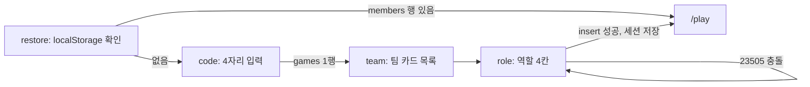

## 5. 화면 설계: 참가(/)와 팀 편집기(/play)

브리프 §3의 두 폰 화면을 구현 치수·컴포넌트·상태 계약으로 확정한다. 상호작용 규칙은 DECISIONS §G·§I, 동기화 세부(디바운스·버전 가드·재구독)는 섹션 03, 페이즈 의미는 섹션 04를 따른다. 두 화면 모두 `'use client'`, 390px 세로 기준이며 데스크톱에서는 가운데 390px 컬럼으로만 렌더한다(**[결정]**).

### 5.1 참가 화면(/) — 3단계 흐름과 실패 케이스

- 컴포넌트: `app/page.tsx` → `JoinFlow`(step: `restore | code | team | role`). 단계는 로컬 state이고 되돌아가기는 화면 안의 "← 뒤로" 버튼이다.
- 마운트 시 `useSession`이 localStorage 키 `owl.session`(`{gameId, teamId, memberId, role}`)을 읽는다. 있으면 `select id from members where id=:memberId` 1회 → 행이 있으면 `router.replace('/play')`, 없으면 세션 삭제 후 code 단계. **[결정]** `/?reset=1`로 열면 세션을 지우고 code 단계부터 시작한다(폰을 다른 사람에게 넘길 때 진행자가 안내).



| 단계 | 화면 요소 | 데이터 |
|---|---|---|
| code | `<input inputMode="numeric" maxLength={4}>` 40px, 자간 0.3em. 4자리가 차면 자동 조회. 안내 "프로젝터의 코드를 입력하세요" | `select id, phase, round from games where code=:code` |
| team | 팀 카드 세로 목록(높이 64: 색 원 12px, 팀 이름 18px 700, 우측 "n/4 접속"), `seat` 순 | `teams`·`members where game_id`. 이 시점부터 `useGameChannel(gameId)`를 열어 인원이 실시간으로 바뀐다 |
| role | 2×2 카드(높이 96): `ROLES[role].label` + 담당 블록 라벨 + 분류색 테두리. 빈 역할만 활성 | `insert into members(game_id, team_id, role) returning id` → `useSession.set` → `/play` |

| 실패 케이스 | 감지 | 반응(문구 그대로) |
|---|---|---|
| 숫자 4자리가 아님 | 입력 검증 | 조회 안 함, 힌트 "숫자 4자리" |
| 코드 없음 | `games` 0행 | 입력 아래 빨간 문구 "게임 코드를 찾을 수 없어요", 입력값 유지 |
| 끝난 게임 | `phase='finished'` | "이미 끝난 게임이에요" |
| 팀이 가득 참 | 그 팀 `members` 4행 | 팀 카드 비활성 + "가득 참"(목록에는 남긴다) |
| 이미 찬 역할 | 같은 `(team_id, role)` 행 존재 | 역할 카드 비활성 + "이미 선택됨" |
| unique 충돌 | insert 에러 code `23505` | 토스트 "방금 다른 사람이 골랐어요", `members` 재조회 후 role 단계 유지 |
| 네트워크 실패 | fetch 예외 | 인라인 "연결을 확인해 주세요" + [다시 시도] |
| 복귀 실패 | restore에서 `members` 0행(진행자가 삭제) | 세션 삭제, code 단계, "참가 정보가 지워졌어요. 다시 참가하세요" |

**[결정]** 참가는 `finished`를 제외한 모든 페이즈에서 허용한다(코딩 중 늦게 온 팀원, 폰 교체). 늦게 들어온 팀원은 §5.8 모드 규칙을 그대로 따른다.

### 5.2 팀 편집기 레이아웃(390px)

세로 5구역, `height: 100dvh`, `viewport-fit=cover`. 스택만 스크롤한다.

| 구역 | 컴포넌트 | 높이(px) | 내용 |
|---|---|---|---|
| 헤더 | `Header` | 48 | 좌 "R3 나선"(15px 700) · 중 `Timer` "04:12"(22px 800, `tabular-nums`) · 우 `Counter` "7/7" 알약(높이 28) |
| 연결 배너 | `OfflineBanner` | 0 / 28 | 끊김일 때만 헤더 아래 펼침(§5.13) |
| 미니맵 | `MiniMap` | 216 | 좌 `MapGrid size={200}`(칸 25) 정사각, 우 158px 컬럼에 맵 이름·`intro`·"상한 7 · 7분"·"탭하면 크게". 행 전체 탭 → `MapSheet` |
| 스택 | `ProgramStack` | 가변(`flex:1`, 최소 160) | 패딩 12 16, `overflow-y:auto`, `overscroll-behavior:contain`. 마지막 블록 아래 여백 96(빈 곳 탭용) |
| 팔레트 | `Palette` | 72 | 가로 스크롤, 아이템 높이 44·최소 폭 120·간격 8, 패딩 14 16 |
| 푸터 | `Footer` | 56 + `env(safe-area-inset-bottom)` | 좌 `Presence`, 우 `SubmitBar`(architect) 또는 상태 문구 |

- 844px 폰에서 스택은 452px(블록 약 9장), 667px 폰에서 275px. **[결정]** 세로 700px 미만이면 미니맵 행을 160(맵 144, 칸 18)으로 줄인다.
- `MapSheet`: 바텀시트 전체 높이, `MapGrid size={352}`(칸 44), 아래에 타일 범례 한 줄과 [닫기]. 부엉이는 항상 `S` 칸에 `startDir`로, 고양이는 `cat.path[0]`에 정지한 틱 0 프레임이다. 시뮬레이션 요소는 없다(브리프 §0-3).

### 5.3 컴포넌트 트리

```
PlayPage (app/play/page.tsx)
├ 훅: useGameChannel · useHeartbeat · useServerClock · useTimer
├ Header ─ RoundLabel · Timer · Counter
├ OfflineBanner
├ MiniMap ─ MapGrid(200) → MapSheet(BottomSheet + MapGrid(352))
├ ProgramStack (스크롤 컨테이너 + DndContext)
│  ├ SlotList(path=[])              ← 최상위 입. 재귀의 시작
│  │   ├ BlockNode(path)            ← BlockCard(plain) | CBlock
│  │   │    └ CBlock ─ Head(BlockCard) · SlotList(path+[0]) · ElseRow · SlotList(path+[1]) · Foot
│  │   └ Cursor                     ← 커서 경로와 일치하는 SlotList 한 곳에만 렌더
│  └ DragOverlay ─ BlockCard(variant="drag")
├ Palette ─ PaletteItem × ROLES[role].blocks
├ Footer ─ Presence · SubmitBar
└ Overlays ─ SealedOverlay · ReadOnlyOverlay · RepeatPicker · DeleteUndoToast · ConflictToast · SubmitSheet
```

- `BlockNode`는 `useProgram`에서 자기 경로의 블록만 셀렉터로 구독하므로 블록 하나의 편집이 스택 전체를 리렌더하지 않는다.
- `MapGrid`·`OwlSprite`·`CatSprite`는 보드와 공용(섹션 06)이며 `/play`는 틱 0 프레임만 넘긴다. `/play`는 `lib/engine/blocks`·`validate`·`maps`만 import한다(섹션 01 §1.7).

### 5.4 zustand `useProgram` 스토어 계약

```ts
// lib/store/program.ts
type Path = number[];  // ENGINE_SPEC §5: 최상위 i = [i], 입 = [i, slot, j] (body/then=0, else=1)
// 커서·삽입 지점도 Path다. 마지막 원소 = 그 슬롯 안의 인덱스(슬롯 길이와 같으면 끝).
interface ProgramState {
  teamId: string; round: number;
  doc: Block[]; version: number;            // 로컬 version, 항상 서버 이상
  submittedAt: string | null;               // programs.submitted_at 미러
  cursor: Path;                             // 로컬 전용, 동기화 안 함
  saveState: 'idle' | 'saving' | 'conflict' | 'offline';
  undo: { doc: Block[]; expiresAt: number } | null;

  load(row: ProgramRow): void;              // 진입·스냅샷 재조회 시
  insertAt(path: Path, block: Block): void; // path 자리에 끼움. uid 없으면 부여
  removeAt(path: Path): Block;              // C-블록이면 입 안까지. undo 스냅샷 저장
  moveTo(from: Path, to: Path): void;       // to는 제거 전 좌표. from이 to의 접두사면 무시
  setRepeatN(path: Path, n: number): void;  // 정수 1~9만
  setCursor(path: Path): void;
  applyRemote(doc: Block[], version: number, submittedAt: string | null): boolean;
  undoDelete(): void;
}
```

- 편집 액션 4개(`insertAt/removeAt/moveTo/setRepeatN`)는 같은 꼬리를 밟는다: 경로 위 노드만 복사한 새 `doc` → `version += 1` → `scheduleSave()`(150ms 디바운스, `update … where version < :v`, 섹션 03). `setCursor`는 저장하지 않는다.
- `applyRemote`: `version > state.version`일 때만 `doc`·`version`·`submittedAt`을 교체하고 `true`. 교체 후 커서가 가리키는 슬롯이 없으면 `[doc.length]`(DECISIONS §D-5). **[결정]** 교체 시 `undo`도 무효화한다 — 다른 사람의 편집 위에 스냅샷을 덮어쓰지 않기 위해.
- `moveTo` 좌표 보정: `from`을 먼저 제거하고, `to`가 같은 부모에서 `from`보다 뒤면 인덱스 1 감산. `to`가 `from`의 하위(접두사 일치)면 아무것도 하지 않는다.
- 파생값은 셀렉터 훅으로만 노출한다: `useCount()` = `countBlocks(doc)`, `useValidation()` = `validate(doc, MAPS[round])`(`doc` 참조가 바뀔 때만 재계산). UI에 세는 코드가 없다(브리프 §0-2).
- `uid`: 삽입 시 `crypto.randomUUID().slice(0, 8)`. dnd-kit 키·React key로만 쓰고 엔진은 무시한다(ENGINE_SPEC §2).

### 5.5 커서 모델과 탭 규칙

DECISIONS §G를 경로로 적는다. `p = [..., k]`는 탭한 블록의 경로, `L(s)`는 슬롯 `s`의 길이.

| 탭한 곳 | 커서(Path) | 비고 |
|---|---|---|
| 일반 블록 본체 | `[..., k+1]` | 그 블록 뒤 |
| C-블록 머리 | `[...p, 0, 0]` | 첫 입 맨 앞 |
| 반복 머리의 N 원 | 이동 없음 | `RepeatPicker` 열림. **[결정]** 커서는 그대로 |
| 입의 빈 영역 / 입 안 마지막 블록 아래 | `[...p, s, L(s)]` | 입 끝 |
| `아니면` 줄 | `[...p, 1, L(else)]` | else 끝 |
| C-블록 꼬리 | `[..., k+1]` | C-블록 뒤. **[결정]** |
| 스택 아래 여백 | `[doc.length]` | 최상위 끝 |
| 팔레트 탭(삽입) 후 | 일반 `[..., i+1]` · C-블록 `[..., i, 0, 0]` | i = 삽입된 인덱스 |
| 롱프레스 삭제 후 | 삭제된 자리 그대로 | 슬롯 길이로 클램프 |
| 원격 교체로 경로 소멸 | `[doc.length]` | |
| `coding` 진입 | `[doc.length]` | |

- 커서 표시: 높이 12px 슬롯 안의 2px 선(`--owl`) + 좌측 ◀ 10px. 슬롯 자체는 탭 대상이 아니다(블록·입·여백 탭이 곧 커서 이동).
- 드래그 중에는 커서를 숨기고 같은 컴포넌트를 `variant="drop"`(`--moon`)으로 드롭 위치에 그린다.

### 5.6 롱프레스 삭제와 되돌리기

- `useLongPress(450)`을 블록 본체(C-블록은 머리)에 건다. `pointerdown` → 타이머 시작, 블록 `scale(.97)`·opacity .8. 취소 조건: `pointerup`, `pointercancel`, 이동 8px 초과, 스택 컨테이너 `scroll` 이벤트, `visibilitychange`.
- 450ms 도달 → `removeAt(path)` 즉시(확인 없음) → `DeleteUndoToast` 3초 "블록을 삭제했어요 [되돌리기]". C-블록이면 "블록 n개를 삭제했어요"(입 안 포함, `countBlocks`).
- `undoDelete()`: 스냅샷 `doc`으로 교체하되 `version`은 현재 값 +1(서버보다 커야 저장된다) → 저장. 되돌리기는 1단계이며 새 편집이 생기면 토스트를 닫는다.
- iOS 컨텍스트 메뉴 방지: 블록에 `-webkit-touch-callout:none; user-select:none`.

### 5.7 dnd-kit 보조 이동

- **[결정]** 드래그 활성 요소는 블록 우측의 그립(`⋮⋮`, 28×44, `touch-action:none`)이다. 본체 롱프레스(450ms 삭제)와 드래그 지연(250ms)이 한 요소에서 충돌하지 않도록 분리한다. `useSortable({ id: uid })`의 `setActivatorNodeRef`를 그립에 준다.
- 센서: `PointerSensor({ activationConstraint: { delay: 250, tolerance: 5 } })` 하나. 키보드 센서 없음.
- 드롭 영역: 슬롯마다 `useDroppable({ id: 'slot:' + pathKey })` — 최상위 `slot:root`, 각 입 `slot:0.0`, `slot:0.1` 식. 블록 자체도 `over` 대상이며 포인터 y(`activatorEvent.clientY + delta.y`)가 블록 중앙 위면 "앞", 아래면 "뒤" 경로를 만든다. 빈 입은 `min-height:44`라 항상 맞출 수 있다.
- 충돌 감지: `pointerWithin` 결과 중 경로가 가장 깊은 것을 고른다(**[결정]** 중첩 입에서 바깥 슬롯이 이기는 문제 방지).
- **[결정]** 라이브 정렬 없음: `useSortable`의 `transform`은 적용하지 않고 `DragOverlay`(블록 복제, 그림자, opacity .95) + 드롭 표시자만 보여 주다가 `onDragEnd`에서 `moveTo(from, to)`를 한 번 호출한다. 중첩 컨테이너의 transform 튐을 피한다.
- 금지 드롭(표시자 숨김, `onDragEnd` 무시): 자기 자신·자기 입 안으로(`to`가 `from`의 접두사), `def`를 최상위 밖으로, `call`을 `def` 입 안으로. §5.9 팔레트 규칙의 이동판이며 최종 판정은 `validate`다.
- 자동 스크롤 `autoScroll={{ threshold: { y: 0.2 } }}`는 스택 컨테이너만. 모드가 편집이 아니면 `useSortable({ disabled: true })`.

### 5.8 편집 모드와 역할 권한 매트릭스

편집기 모드는 `games.phase`, `programs.submitted_at`, 남은 시간으로 정한다(페이즈 전이는 섹션 04).

| mode | 조건 | 스택 | 팔레트 | 오버레이/문구 |
|---|---|---|---|---|
| lobby | phase=lobby | 비어 있음 | 숨김 | "진행자가 라운드를 시작하면 편집할 수 있어요" |
| editing | phase=coding ∧ submitted_at=null ∧ 남은 시간>0 | 편집 | 표시 | — |
| timeout | phase=coding ∧ submitted_at=null ∧ 남은 시간≤0 | 읽기 전용 | 숨김 | "시간 종료 · 봉인 대기"(자기 전이 금지, DECISIONS §E) |
| sealed | submitted_at≠null (coding·sealed·running) | 읽기 전용 | 숨김 | `SealedOverlay` "봉인됨 · 12:34 제출 · 7블록" |
| patching | phase=running ∧ submitted_at=null | 편집 | 표시 | 상단 배너 "패치 모드 · 블록 1개만 · −10점" |
| running | phase=running ∧ 봉인 | 읽기 전용 | 숨김 | "실행 중 · 프로젝터를 보세요" |
| scored | phase=scored | 읽기 전용 | 숨김 | `results` 요약 "둥지 도착 · 150점" |
| finished | phase=finished | 읽기 전용 | 숨김 | "최종 순위는 프로젝터에" |

- **[결정]** `editable = submitted_at === null && ((phase === 'coding' && remaining > 0) || phase === 'running')`. `running`에서 `submitted_at`이 null인 팀은 진행자가 패치를 허용한 팀뿐이다(DECISIONS §F).
- 오버레이는 스택 위에 `pointer-events:none`으로 얹는다. 스크롤(코드 확인)은 되고 탭·롱프레스·드래그는 모드 플래그로 막는다.
- **[미결]** `scored` 모드에서 자기 팀 결과 요약을 폰에 보여 줄지, 프로젝터에 집중시키려 숨길지.

역할 × 동작(모드가 editing/patching일 때):

| 동작 | Runner | Turner | Controller | Architect |
|---|---|---|---|---|
| 팔레트 노출 | 앞으로·점프 | 좌회전·우회전 | 반복·만약 앞이 벽이면·만약 앞이 구덩이면 | 함수 F·F 호출·잠자기 |
| 삽입 | 자기 블록만 | 자기 블록만 | 자기 블록만 | 자기 블록만 |
| 이동(드래그) | 모든 블록 | 모든 블록 | 모든 블록 | 모든 블록 |
| 삭제(롱프레스) | 모든 블록 | 모든 블록 | 모든 블록 | 모든 블록 |
| 반복 N 변경 | 가능 | 가능 | 가능 | 가능 |
| 제출·재제출 | 버튼 없음 | 버튼 없음 | 버튼 없음 | 가능 |

**[결정]** 반복 N 변경은 전원 허용. 남의 블록을 지울 수 있는데 숫자만 못 바꾸면 Controller 부재 시 교착이 생긴다. 권한은 클라이언트 규약이며 서버는 강제하지 않는다(섹션 01 §1.8).

### 5.9 팔레트 활성 규칙

`PaletteItem`은 `BLOCK_ORDER` 순, 아이템 = 44px 블록 카드 축소판(라벨만). 비활성은 opacity .38 + 탭 시 아이템 아래 힌트 1.5초.

| 블록 | 비활성 조건 | 힌트 |
|---|---|---|
| 전부 | mode ∉ {editing, patching} | 팔레트 자체를 숨김 |
| def | `cursor.length !== 1`(최상위 아님) | "맨 바깥에만 둘 수 있어요" |
| def | `doc`에 `def`가 이미 있음 | "함수 F는 하나만" |
| call | `doc`에 `def` 없음 | "함수 F를 먼저 만드세요" |
| call | 커서가 def 입 안(`cursor[0]` = def 인덱스 ∧ `cursor[1] === 0`) | "F 안에선 F를 못 불러요" |

- 상한 도달은 삽입을 막지 않는다. 카운터가 빨개지고 제출이 막힐 뿐이다(브리프 §3 "초과 시 빨강").
- 삽입 기본값: `repeat {n:2, body:[]}`, `if_* {then:[], else:[]}`, `def {body:[]}`.
- 이 규칙은 `validate`의 E_DEF_NESTED·E_DEF_MULTI·E_CALL_NO_DEF·E_RECURSION을 미리 막는 편의다. 다른 팀원이 `def`를 이동으로 입 안에 넣는 등 우회가 생기면 제출 버튼이 `validate.errors[0]`를 보여 준다.

### 5.10 카운터·타이머·제출 버튼 상태표

| 표시 | 조건 | 스타일 |
|---|---|---|
| `Counter` "0/12" | n=0 | `--moon-dim` |
| "7/12" | 1 ≤ n ≤ cap | `--moon`, 배경 `--night-2` |
| "13/12" | n > cap | 글자·테두리 `#FF5A5A`, 배경 `#FF5A5A` 18% |
| `Timer` "04:12" | 남은 시간 > 30초 | `--moon` |
| "00:29" | ≤ 30초 | `#FF5A5A` |
| "⏸ 04:12" | 일시정지(`timer_ends_at` null, `timer_remaining` 표시) | `--moon-dim` |

`SubmitBar`(architect에게만 렌더, 버튼 높이 44·최소 폭 112):

| 상태 | 조건 | 라벨 | 활성 |
|---|---|---|---|
| 대기 | mode=editing ∧ `validate.ok` | 제출 | 예, 배경 `--owl` |
| 불가 | mode=editing ∧ `!validate.ok` | 제출 + 아래 12px `errors[0]`(예: "블록 상한 초과 (13/12)") | 아니오 |
| 확인 | 탭 후 `SubmitSheet` | "봉인하면 수정할 수 없어요 · 7/7 블록" [취소] [봉인하고 제출] | — |
| 제출 중 | `submit_program` 요청 중 | 제출 중… | 아니오 |
| 봉인됨 | `submitted_at≠null` | 봉인됨 12:34 | 아니오 |
| 패치 | mode=patching ∧ `validate.ok` | 재제출 (−10점) | 예 |
| 오프라인 | `saveState='offline'` | 제출 | 아니오 |
| 그 외 모드 | timeout·running·scored·finished | 버튼 숨김 | — |

- 비-architect의 푸터 우측은 문구만: 제출 전 "제출은 Architect가", 봉인 후 "봉인됨 12:34".
- `submit_program` 호출 전에 대기 중인 디바운스 저장을 flush한다. 응답 행의 `submitted_at`을 `applyRemote`로 반영해 Realtime보다 먼저 봉인 UI가 뜬다.

### 5.11 블록 컴포넌트 스타일 이식표

`cards.html`의 CSS를 `app/globals.css` `@layer components`에 같은 클래스명으로 옮기고, 컴포넌트는 `clsx('blk', BLOCKS[id].category)`로 붙인다. 노치는 pseudo-element 그대로 유지한다(Tailwind로 다시 쓰지 않는다). 폰 값은 `.play` 루트 클래스 아래에서 덮어쓴다.

| cards.html | 컴포넌트/클래스 | 카드 값 → 폰 값 |
|---|---|---|
| `:root --blk-h` | `.play` | 56 → 44 |
| `--notch-x / -w / -h` | 〃 | 22/34/8 → 16/28/6 |
| `.blk` | `BlockCard` | width 300 → 100%; font 21 → 17; padding 0 16 0 18 → 0 12 0 14; gap 12 → 8; radius 12 → 10 |
| `.blk.long` | `BlockCard`(if_*) | font 16 → 14 |
| `.blk::before / ::after` | 그대로 | 위 홈(`--night`)·아래 돌기(`background:inherit`). 스택·입 배경이 `--night`여야 홈이 보인다 |
| `.blk svg` | `icons.tsx`(cards.html path 복사) | 26 → 22 |
| `.blk .kw`, `.blk .tick` | — | **[결정]** 스택·팔레트 모두 숨김(390px에 자리 없음) |
| `.blk .n` | `RepeatN`(버튼) | 30 → 26, font 16 → 14, 탭 영역은 `::before`로 44×44 확장 |
| `.cblk` | `CBlock` | width 300 → 100% |
| `.cblk .mouth` | `Mouth` | margin-left 22 → 16; padding 8 0 10 10 → 6 0 8 8; min-height 44 유지 |
| `.cblk .else` | `ElseRow` | height 36 → 32; font 16 → 14 |
| `.cblk .foot` + `::after` | `Foot` | height 22 → 18, 돌기 유지 |
| `.stack > * + *` | `SlotList` | margin-top 2 유지, 커서 슬롯 12 추가 |
| `.move/.turn/.control/.function/.special` | 분류 클래스 | 색 변수 동일(`CATEGORIES` 값과 일치) |

- 상태 변형: `.blk.is-dragging`(원래 자리 opacity .3), `.blk.is-pressing`(scale .97). 누가 놓았는지 표시하는 변형은 두지 않는다.
- 폰트: `layout.tsx`에서 Pretendard CDN, 블록 라벨 800, 나머지 500~700(브리프 §5).

### 5.12 접근성과 터치

- 터치 타깃 ≥ 44px: 블록 높이 44, 팔레트 아이템 44, N 원 44(확장), 그립 28×44(여백 포함 44), 푸터 버튼 44, 참가 화면 입력·카드 ≥ 56.
- `touch-action`: 스택 `pan-y`, 그립 `none`, 버튼 `manipulation`(더블탭 확대 방지). 롱프레스 중 스크롤이 시작되면 취소(§5.6).
- 햅틱 없음(`navigator.vibrate` 미사용), 소리 없음. `prefers-reduced-motion`이면 오버레이·시트 전환 0ms.
- 스크린리더 최소치: 블록 `role="button" aria-label="앞으로, 3번째"`, 비활성 팔레트 `aria-disabled` + 힌트를 `aria-describedby`. 색만으로 정보를 주는 곳(역할 점)은 라벨 텍스트를 함께 둔다.
- 글자 최소 12px. 분류색 위 잉크색은 `CATEGORIES.ink` 그대로.

### 5.13 오프라인·재연결 표시

| 신호 | 출처 | 표시 |
|---|---|---|
| 채널 재구독 중 | `useGameChannel` 상태(CLOSED/CHANNEL_ERROR 후 백오프) | `OfflineBanner` "연결이 끊겼어요 · 다시 연결 중…" 배경 `#FF5A5A` 20%, 높이 28 |
| `navigator.onLine=false` | `online/offline` 이벤트 | 같은 배너, `saveState='offline'`, 제출 비활성 |
| 저장 실패(예외) | `scheduleSave` | 배너 유지, 재연결 시 재시도 |
| 저장 충돌(영향 행 0) | 섹션 03 규약 | `ConflictToast` "다른 팀원이 먼저 저장했어요" |
| 팀원 오프라인 | `members.last_seen` 25초 초과 | `Presence` 점 opacity .35 |

- **[결정]** 재연결 순서: 대기 중 저장 flush → 스냅샷 재조회 → `applyRemote`. 끊긴 동안의 편집은 로컬에 살아 있고, 서버 버전이 더 크면 규약대로 서버본으로 교체된다(오프라인 편집 보존은 범위 밖, DECISIONS §K).
- `Presence`: 역할 4칸 고정 순서(runner→turner→controller→architect), 점 10px 분류색 + 역할 라벨 11px. 빈 역할은 점선 원 + "비어 있음", 자기 자신은 밑줄. 하트비트는 `useHeartbeat` 10초(DECISIONS §D).
- `visibilitychange`로 탭이 돌아오면 즉시 하트비트 1회 + 스냅샷 재조회.
