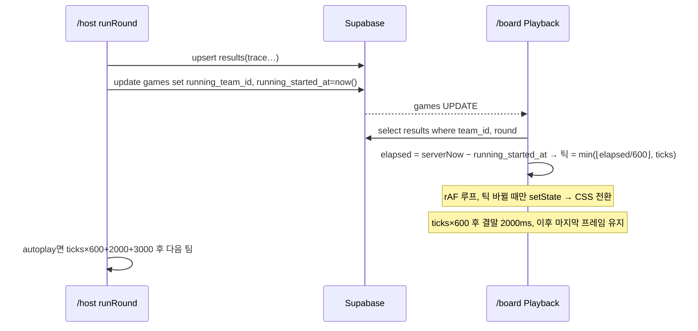

## 6. 화면 설계: 진행자(/host)와 보드(/board)

두 화면 모두 데스크톱 전용이며 `useGameChannel(gameId)`(DECISIONS §D)로 전 테이블을 구독한다. 진행자 화면은 `games`·`teams`·`results`의 유일한 작성자이고, 보드는 아무것도 쓰지 않는다(섹션 01 §1.4). 페이즈 전이 함수와 실행 순회(`lib/host/phases.ts`, `runRound.ts`)의 내부는 섹션 04가 다루고, 여기서는 버튼·표·레이아웃과 재생 엔진만 정한다.

### 6.1 진행자 화면 레이아웃

- 최소 폭 1280px. 상단 헤더 56px + 3열 그리드 `300px | 1fr | 440px`. 본문 14px, 표 13px, Tailwind 다크 토큰 그대로.
- 헤더: 게임 코드(클릭 시 복사) · `R3 나선 · 중간 · 상한 7` · 페이즈 배지 · Realtime 연결 표시 · 버튼 `보드 열기`(새 창 `/board?code=XXXX`) · `정답 보기` · `이벤트 카드` · `새 게임`.
- 좌 열 `RoundPanel` + `TimerControls` + `EventCardPanel`(접힘): 현재 페이즈, 주 버튼 1개(라벨은 §6.4), `이전 페이즈로`, 타이머 `mm:ss` 40px(30초 이하 빨강), `일시정지`/`재개`, `+30초`, 체크박스 `재생 끝나면 자동으로 다음 팀`(`games.autoplay`).
- 중 열 `TeamTable`(§6.3). 행 클릭 = 선택, 재생 중 팀은 ▶ 표시.
- 우 열 `TeamDetail` **[결정]**(섹션 01 §1.6의 host 컴포넌트에 추가): 팀 이름·색, 역할 4칸(접속 상태, `제거` 버튼 — DECISIONS §I), 코드 미리보기 `<pre>`(`toText(doc).text`, 줄 번호, 14px, 코딩 중에도 실시간), `validate` 결과(통과면 `제출 가능 5/7`, 실패면 `errors[]` 목록 빨강), 결과 줄(outcome 배지 · `message` · `ticks`틱 · 🐭n), 점수 줄 표(`score_lines` 라벨/점수 + 합계), 버튼 `패치 허용` · `재실행` · `보드에 코드 띄우기`, 이벤트 점수 입력란(§6.6).

### 6.2 게임 생성 폼(`GamePanel`)

- 진입 시 `localStorage.owl.host = {gameId}`가 있으면 그 게임으로 복귀, 없으면 폼. 항목은 팀 수 셀렉트(4·5·6, 기본 4)뿐이다. `만들기` → `games` insert → `teams` n행 insert(`seat` 1..n, `patch_left` 1) → 로비.
- 팀 이름·색은 좌석 순으로 고정 배정한다. **[결정]** 색 팔레트(분류색 5개와 겹치지 않게 고른다):

| seat | name | color |
|---|---|---|
| 1 | 수리부엉이 | `#FF5E5B` |
| 2 | 올빼미 | `#4EA8FF` |
| 3 | 소쩍새 | `#F9D65C` |
| 4 | 흰올빼미 | `#F6F2FF` |
| 5 | 금눈쇠올빼미 | `#FF8A3D` |
| 6 | 칡부엉이 | `#A3E635` |

- **[결정]** 게임 코드 4자리는 문자 집합 `ACDEFGHJKMNPQRTUVWXY34679`(25자)에서 `crypto.getRandomValues`로 뽑는다. 프로젝터·손글씨에서 헷갈리는 `0/O`, `1/I/L`, `2/Z`, `5/S`, `8/B`를 뺐다. `games.code unique` 충돌 시 재생성 최대 5회. 참가 화면은 입력을 대문자로 정규화한다(섹션 05).

### 6.3 팀 표 컬럼

| 컬럼 | 소스 | 표시 규칙 |
|---|---|---|
| 팀 | `teams.seat/name/color` | 색 점 + 이름 |
| 접속 | `members.last_seen` | `3/4`. 역할 4칩: 접속=채움, 25초 초과=윤곽, 미참가=회색 |
| 블록 | `countBlocks(programs.doc)` | `5/7`, 초과 시 빨강 |
| 상태 | `programs.submitted_at/submit_order` | `편집 중` · `제출 12:04:31 #2` · `자동 제출` · `패치 중`(submitted_at null & patch_left 0) |
| 결과 | `results.outcome/message/ticks` | 배지 도착/에러/사망/정지 + 문구 + 틱. 재생 중이면 `12/20` 진행 |
| 점수 | `results.score` | 라운드 점수. 이벤트 줄 있으면 `+10` 꼬리표 |
| 누적 | 전 라운드 `results.score` 합 | `rankTeams()` 순위 함께(§6.11) |
| 패치권 | `teams.patch_left` | ● / ○ |

### 6.4 버튼 활성 조건표

| 버튼 | lobby | coding | sealed | running | scored | finished |
|---|---|---|---|---|---|---|
| 주 버튼 라벨 | `코딩 시작 (R1)` | `지금 봉인` | `전체 실행` | `점수판 열기` | `다음 라운드 (R{n+1})` / R5면 `최종 순위` | 없음 |
| 주 버튼 조건 | 팀마다 architect 접속 아니면 경고만 | 항상 | 항상 | 전 팀 `results` 존재 ∧ 재생 종료 | 항상 | — |
| `일시정지`/`재개`, `+30초` | ✗ | ✓ | ✗ | ✗ | ✗ | ✗ |
| `다음 팀` | ✗ | ✗ | ✗ | 남은 팀 있음 | ✗ | ✗ |
| `패치 허용` | ✗ | ✗ | ✗ | 선택 팀 `outcome∈{error,dead,stuck}` ∧ `patch_left=1` ∧ 그 팀 재생 종료 | ✗ | ✗ |
| `재실행` | ✗ | ✗ | ✗ | 선택 팀 `patch_left=0` ∧ `submitted_at` 다시 채워짐 | ✗ | ✗ |
| 이벤트 점수 `반영` | ✗ | ✗ | ✗ | 선택 팀 `results` 존재 | ✓ | ✗ |
| `보드에 코드 띄우기` | ✗ | ✗ | ✓ | 재생 종료 후 | ✓ | ✗ |
| `이전 페이즈로` | ✗ | ✓ | ✓ | ✓ | ✓ | ✓ |
| `정답 보기`, `팀원 제거`, `새 게임` | ✓ | ✓ | ✓ | ✓ | ✓ | ✓ |

- 타이머 만료 자동 봉인은 버튼과 무관하게 진행자 화면이 수행한다(DECISIONS §E).
- `전체 실행` 후 `autoplay`면 `runRound.ts`가 `ticks×600 + 2000 + 3000ms` 타이머로 다음 팀을 밀고, 진행자 표의 `12/20` 진행도 같은 시각 계산에서 나온다. 보드에서 오는 신호는 없다.

### 6.5 정답 보기 토글(`SolutionsDrawer`)

- 헤더 `정답 보기` → 우측 드로어 480px. 현재 라운드 `SOLUTIONS.r{round}`(예: `SOLUTIONS.r3`)를 `toText` 텍스트로 나열하고 진행자 화면만 가진 `run`·`score`로 `블록 5 · 20틱 · 150점`을 곁들인다. 기본 닫힘, 페이즈 전이 시 자동 닫힘 **[결정]**(진행자 화면이 카메라에 잡혀도 오래 노출되지 않게).
- 팀 화면·보드 격리 방법 **[결정]**: (1) 정답은 DB에 절대 쓰지 않는다. (2) `lib/engine/solutions`를 import하는 파일은 `components/host/SolutionsDrawer.tsx` 하나뿐이고, 섹션 01 §1.7의 ESLint `no-restricted-imports` 대상에 `app/board/**`, `components/board/**`, `components/map/**`, `components/ui/**`를 추가한다. (3) 드로어는 `next/dynamic`으로 지연 로드해 정답 청크가 드로어를 처음 열 때만 요청되게 한다. 섹션 10에서 `/play`·`/board` 로드 시 네트워크에 그 청크가 없음을 검사한다.

### 6.6 이벤트 카드 패널(`EventCardPanel`)

- DECISIONS §J의 카드 2장을 텍스트로 안내한다: `코드 리뷰 +10`(모든 재생이 끝난 뒤, 점수 확정 전), `핫픽스 +5`(sealed, 실행 전). 둘 다 아래 `보드에 코드 띄우기`를 쓴다. 운영 대본은 섹션 08.
- `보드에 코드 띄우기`는 `games.spotlight_team_id` **[결정]**(섹션 03에 컬럼 추가)에 팀 id를 쓴다. 보드는 이 값이 있으면 어느 페이즈든 `CodePanel`을 전체 폭으로 덮어 보여 주고(팀 이름 + 블록 수, 결과는 숨김), `끄기`로 null.
- 수동 점수: `TeamDetail` 하단에 셀렉트(`코드 리뷰 +10` / `핫픽스 +5` / `직접 입력`) + 정수 입력 + `반영`. 처리는 `results.score_lines`에 `{label:'이벤트: 코드 리뷰', points:10}`을 추가하고 `results.score = max(0, score + points)`로 갱신하는 것뿐이다. **[결정]** 패치 `재실행`으로 `results`를 덮어쓸 때 `runRound.ts`는 기존 `score_lines` 중 라벨이 `이벤트: `로 시작하는 줄을 새 결과에 다시 붙인다(진행자가 재입력하지 않게).

### 6.7 위험 동작 확인 다이얼로그

네이티브 `<dialog>`, 기본 포커스는 `취소`, Esc = 취소.

| 동작 | 문구 | 확인 라벨 |
|---|---|---|
| `지금 봉인` | 남은 시간 03:12. 미제출 n팀은 현재 코드로 자동 제출된다. | 봉인 |
| `전체 실행`(컴파일 에러 팀 있을 때만) | n팀이 컴파일 에러 상태다. 0틱 에러로 기록된다. | 실행 |
| `다음 팀`(재생 중) | 재생 중인 {팀}을 건너뛴다. 결과는 남는다. | 건너뛰기 |
| `패치 허용` | {팀} 패치권을 쓴다. −10점, 게임 전체 1번뿐이다. | 허용 |
| `재실행` | 이전 결과({outcome} · {score}점)를 덮어쓴다. | 재실행 |
| `점수판 열기` | 이후 패치 불가. 이벤트 점수는 점수판에서 계속 수정 가능하다. | 열기 |
| `다음 라운드`/`최종 순위` | R{n} 점수가 확정된다. | 확정 |
| `이전 페이즈로`(running→sealed) | 이 라운드 결과 n건이 삭제된다. | 되돌리기 |
| `팀원 제거` | {팀} {역할}을 제거한다. 그 폰은 참가 화면으로 돌아간다. | 제거 |
| `새 게임` | 현재 게임 {code}에서 나간다(데이터는 남는다). | 나가기 |

### 6.8 보드 공통 규칙과 페이즈별 레이아웃

- **[결정]** 루트 `<div class="board">`는 1920×1080 고정이고 `transform: scale(min(vw/1920, vh/1080))`로 가운데 정렬한다. 해상도가 달라도 레터박스만 생기고 좌표 계산은 항상 1920×1080 기준이다.
- **[결정]** 10m 가독 기준: 100인치 1080p에서 1px ≈ 2mm, 10m에서 글자 높이 ≥ 50mm가 필요하므로 보조 텍스트 최소 32px, 본문 36px, 팀 이름 48px 이상, 핵심 수치 ≥ 96px. 이보다 작은 글자는 보드에 두지 않는다. 배경 `--night`, 글자 `--moon`/`--moon-dim`, 패널 `--night-2`, 팀 색은 배지·바에만.

| 페이즈 | 컴포넌트 | 영역 배분(px) | 폰트 |
|---|---|---|---|
| lobby | `LobbyView` | 상단 160: `OWL COMPILE` + 참가 URL·QR **[결정]**(`qrcode` npm, 클라이언트 생성). 중앙 y 200~560: 게임 코드. 하단 y 620~1020: 팀 카드 최대 6열, 각 280×360 | 코드 260px 자간 0.2em, URL 40px, 팀 이름 40px, 역할 칩 56px 원, `n/4` 48px |
| coding | `MapGrid` + `Timer` + 팀 띠 | 좌 (80,160) 맵 720² (셀 82px). 우 x 900~1840: 라운드 제목·`intro`·타이머. 하단 y 900~1060 팀 카드 띠 | 제목 64px, intro 36px, 타이머 200px(30초 이하 `#FF5E5B` 맥동), 팀 이름 36px, `제출 완료 ✓ 5블록`/`편집 중` 32px |
| sealed | coding 그대로 | 타이머 자리에 `봉인 완료` + 제출 순서 `#1 소쩍새 …` | 72px / 40px |
| running | `Playback` | §6.9 | §6.9 |
| scored | `Scoreboard` | 좌 x 60~960 라운드 점수 카드 세로 목록. 우 x 1020~1860 누적 순위 6행(행 110px) | 팀 48px, 점수 줄 32px, 합계 64px, 순위 숫자 72px, 누적 64px |
| finished | `Scoreboard` 전체 폭 | 1위 카드 중앙 확대 + 2~6위 목록 | 1위 팀 이름 96px |

- 코딩 중 코드는 절대 보드에 나오지 않는다(블록 수만). 보드는 `programs.doc`를 읽지만 `countBlocks`만 호출한다.

### 6.9 running 화면과 재생 엔진

레이아웃: 상단 바 높이 120(좌 팀 색 점 + 팀 이름 64px, 중앙 `R3 나선` 40px, 우 `틱 12 / 20` 56px `tabular-nums` + `🐭 ×1` `🔑` 40px). 좌 맵 컨테이너 900² at (60,150) — **[결정]** 안쪽 패딩 20, 셀 104, 간격 4 (8×104 + 7×4 + 40 = 900). 우 `CodePanel` at (1020,150), 840×780: 줄 높이 52px, 폰트 36px, 줄 번호 열 60px `--moon-dim`, 들여쓰기 1단계 = 40px, 15줄 표시, 더 길면 현재 줄이 3~12행 사이에 오도록 `translateY` 스크롤. 하단 `EventToast` 중앙 y 960, 높이 88, 44px.



- **[결정]** `games.running_started_at timestamptz` 컬럼을 추가한다(섹션 03). 이유 둘: 패치 재실행은 `running_team_id`가 같아 보드가 변화를 못 보는데 이 값 갱신으로 `games` UPDATE가 생기고, 새로고침 복구 때 정확한 틱으로 돌아갈 수 있다. 진행자는 반드시 `results` upsert 뒤에 `games`를 갱신한다(보드가 재조회 시 새 결과를 읽도록).
```ts
// lib/hooks/usePlayback.ts — 보드 전용. 게임 로직 없음, trace 인덱싱만 한다.
export function usePlayback(input: {
  trace: Step[]; startedAt: number /* 서버 시각 ms */; serverOffset: number;
}): { tick: number; step: Step; phase: 'playing' | 'ending' | 'held'; endingMs: number };
```

- 스케줄러(`usePlayback`): `setTimeout` 체인을 쓰지 않는다. 마운트 시 `anchor = performance.now() − elapsed`를 잡고 `requestAnimationFrame` 루프에서 `tick = min(⌊(performance.now() − anchor)/600⌋, ticks)`를 계산해 값이 바뀔 때만 프레임 상태를 갱신한다(React 리렌더 틱당 1회, 누적 드리프트 0 — 섹션 01 §1.8). 탭이 숨겨져 rAF가 멈춰도 복귀 시 같은 식으로 현재 틱에 바로 맞춘다.
- 프레임 = `trace[tick]`의 순수 함수: 부엉이 `translate(x·108px, y·108px) rotate(θ)`(이동 전환 450ms ease-in-out, 회전 300ms — DECISIONS §H), 고양이 `step.cat` 동일. **[결정]** 방향각은 N 0° · E 90° · S 180° · W 270°이되 누적각으로 관리해 W→N이 270°→360°로 짧게 돈다. 점프(직전 프레임과 2칸 차이)는 같은 450ms에 `scale 1→1.15→1`을 얹는다. 타일 층은 `step.eaten/taken`에 든 칸의 🐭/🔑를 300ms 페이드로 지우고 `step.opened`의 🚪를 `opacity .3`으로 바꾼다.
- 코드 하이라이트: `toText(doc).lines`를 그대로 그리고 `step.line` 줄에 배경 `--owl` 30% + 좌측 바 6px. `line`은 항상 액션 블록 줄이라(ENGINE_SPEC §5) C-블록 머리 줄은 저절로 빠진다. 틱 0은 하이라이트 없음. `step.message`가 있으면 토스트 1.2초.
- 결말(`ticks×600` 시점, 마지막 프레임 전환이 끝난 뒤): `dead`/`error` → `.board` 좌우 ±12px 흔들림 400ms + `results.message` 96px 오버레이 1.5초(부엉이 `opacity .35`); `stuck` → 흔들림 없이 `message` 오버레이 1.5초; `goal` → 둥지 글로우 `0 0 60px` 맥동 + 점수 카드(맵 우측 하단)에 `score_lines`가 300ms 간격으로 쌓이고 마지막에 합계 120px 팝. 컴파일 에러(`ticks 0`)는 초기 프레임 위에 곧바로 오버레이. 결말 후 점수 카드와 마지막 프레임은 `running_started_at`이 바뀔 때까지 유지한다.

### 6.10 스프라이트와 타일 렌더 규칙

- `OwlSprite`: `cards.html` 히어로 SVG(viewBox 64, 머리 `#7A4DFF`, 눈 `#F6F2FF`/`#14102A`, 부리 `#FFB020`)를 셀 안에 84px로 놓고 머리 위에 18px 삼각 화살표(`--moon`)를 붙인 그룹 전체를 회전한다(브리프 §5). 폰 미니맵(섹션 05)은 같은 컴포넌트에 `cell` prop만 다르게 준다.
- `CatSprite`: 🐱 64px, 전환 규칙은 부엉이와 같다.
- `MapGrid`는 타일 층(CSS grid)과 스프라이트 층(absolute)을 분리해 transform 전환이 레이아웃을 건드리지 않게 한다. 좌표 `tiles[y][x]`.

| 문자 | 렌더 | 토큰/값 |
|---|---|---|
| `.` | 바닥 사각형, 반경 10px | `--tile-floor #1E1740` |
| `#` | 밝은 보라회색 블록, 위 테두리 2px | `--tile-wall #5A5080`, 테두리 `#7A7099` |
| `O` | 바닥 위 검은 원 72px + 안쪽 그림자 | `#050308`, `inset 0 8px 16px #000` |
| `M` | 🐭 56px, `eaten`이면 제거 | — |
| `K` | 🔑 56px, `taken`이면 제거 | — |
| `D` | 🚪 64px, 문틀 배경. `opened`면 `opacity .3` | `--tile-door #3A2D6B` |
| `S` | 바닥 + 얇은 점선 링(시작 표시). 부엉이는 스프라이트 층 | 링 `--owl` 2px dashed |
| `G` | 금색 링 4px + 글로우. 도착 시 글로우 60px 맥동 | `--nest #F5C451`, `0 0 24px rgba(245,196,81,.6)` |
| `c` | 바닥 + 분홍 점선 테두리 2px | `--special #FF6B9A` dashed |

### 6.11 scored 화면

- 좌측 라운드 점수: 팀 카드를 라운드 점수 내림차순으로 세로 배치하고 카드마다 `score_lines`를 300ms 간격, 카드 사이 400ms 간격으로 등장시킨 뒤 합계를 띄운다(6팀 ≤ 9초). 이벤트 점수가 나중에 반영되면 해당 카드만 다시 그린다.
- 우측 누적 순위: 처음 1.5초는 이전 라운드까지의 순서로 보여 주고, 새 순서로 FLIP 전환 600ms, 행 끝에 ▲▼ 변동 표시. **[결정]** 순위 계산(누적 → 도착 라운드 수 → 총 틱, DECISIONS §F)은 `lib/ranking.ts`의 `rankTeams(teams, results)` 하나를 진행자 표와 보드가 공용한다.
- R5 `최종 순위` → `finished`: 우측 목록이 전체 폭으로 펼쳐지고 1위 카드가 중앙에 96px로 확대된다. 공동 순위는 같은 숫자로 표기한다.

### 6.12 보드 새로고침 복구

- **[결정]** 진입은 `/board?code=XXXX`, 없으면 `localStorage.owl.board.code`, 둘 다 없으면 코드 입력 화면. 마운트 시 `loadGameSnapshot`으로 전 테이블을 읽고 `deriveBoardState(snapshot, serverNow)` 순수 함수로 화면을 정한다. 재연결 후 스냅샷 재조회도 같은 함수를 지난다.
- `running`이면 `elapsed = serverNow − running_started_at`. `elapsed < ticks×600`이면 그 틱부터 이어서 재생, 아니면 마지막 프레임 + 결말 상태(연출 생략, 점수 카드 즉시 표시) — DECISIONS §H의 "마지막 프레임 표시"를 만족하면서 재생 중 새로고침도 끊김 없이 잇는다.
- `coding`은 `timer_ends_at`/`timer_remaining`과 서버 오프셋으로 즉시 정확한 남은 시간을, `scored`는 애니메이션을 처음부터 다시(무해), `spotlight_team_id`가 있으면 코드 오버레이를 복원한다.

### 6.13 프로젝터 실전 팁

- 진행자 노트북의 확장 디스플레이에 보드 창을 띄우고 F11 전체화면. 미러링은 정답 드로어와 팀 표가 그대로 비치므로 금지(섹션 01 §1.2).
- OS 디스플레이 배율 100%, 해상도 1920×1080, 브라우저 확대 100%(`Ctrl+0`). 배율이 다르면 `scale` 래퍼가 맞추지만 글자가 흐려진다.
- **[결정]** 보드는 마우스가 3초 멈추면 `cursor: none`. 마우스는 진행자 화면 쪽에 둔다.
- 절전·화면보호기·알림(집중 모드) 끄기. 리허설에서 10m 뒤 자리에서 코드 패널 36px이 읽히는지 확인하고, 안 읽히면 강당 조명을 낮춘다.
- **[미결]** 효과음(쥐 획득·사망·도착) — 기본은 무음. 강당 스피커가 있으면 섹션 08에서 결정한다.
- **[미결]** 강당 프로젝터 밝기가 낮아 `--night` 배경이 회색으로 뜨는 경우 조명 소등 여부(리허설 때 확인).
