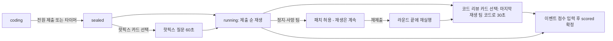

## 8. 행사 운영 시나리오와 이벤트 카드

소프트웨어 바깥의 절차를 정한다. 기준 인원은 6팀 24명, 총 90분, 운영진 3명(진행자 1 · 타임키퍼 1 · 카메라·접속 도우미 1). 페이즈 전이와 타이머 규칙은 DECISIONS §E·§F와 섹션 04를 따르고, 여기서는 "언제 어떤 버튼을 누르고 무슨 말을 하는지"만 다룬다.

### 8.1 오리엔테이션 타임라인 (6팀 · 90분)

**실행·재생 시간 계산식** (DECISIONS §F: 재생 길이 = 틱 × 600ms + 2000ms, autoplay 시 +3초)

- 팀당 재생 = 틱 × 0.6초 + 2초(결말 연출) + 3초(자동 전환)
- 라운드 실행 = 팀 수 × (팀당 재생 + 10초 진행자 리액션)
- 틱 값: R3 20틱·R5 37틱은 엔진 스펙 §8 고정값. R1 12·R2 14·R4 24는 정답 길이 추정치이며 섹션 07 확정 후 갱신한다. 실패 팀은 대개 정답보다 일찍 멈추므로 정답 틱을 평균 상한으로 쓴다.

| R | 틱 | 팀당 재생 | 6팀 실행(리액션 포함) | 배정 |
|---|---|---|---|---|
| 1 | 12 | 12.2초 | 133초 | 2.5분 |
| 2 | 14 | 13.4초 | 140초 | 2.5분 |
| 3 | 20 | 17.0초 | 162초 | 3분 |
| 4 | 24 | 19.4초 | 176초 | 3분 |
| 5 | 37 | 27.2초 | 223초 | 4분 |
| 합 | | | | **15분** |

**브리프 항목만 더한 합계**: 소개 10 + 튜토리얼 5 + 코딩 36(5/6/7/8/10) + 실행 15 + 점수·전환 10 + 발표 5 = **81분**. 그러나 브리프가 세지 않은 비용이 있다 — 접속·역할 선택 5분, 패치권 직렬 처리(허용→수정→재제출→재실행 약 90초, 6팀이 1장씩이므로 라운드 평균 1.2회 ≈ 9분), 이벤트 카드 2회 4분. 전부 넣으면 **99분**으로 9분 초과한다.

**조정안** (아래 5개를 적용해 84분 + 여유 6분)

1. 접속은 입장·착석과 병행한다. 보드 `lobby` 화면(코드 + 팀별 접속 인원)을 행사 10분 전부터 띄운다.
2. **[결정]** 패치는 재생을 멈추지 않는다. "패치 허용"을 눌러도 autoplay는 다음 팀으로 계속 진행하고, 패치 팀이 재제출하면 그 라운드의 마지막 순서로 "재실행"한다. 패치 비용은 재실행 30초로 줄어 라운드당 1분이면 된다(운영 흐름은 8.5 그림).
3. 점수·전환은 R1~R4 1.5분, R5 2분. 점수판은 자동이므로 진행자는 "1위 팀"과 "가장 많은 사망 원인" 두 가지만 말한다.
4. 이벤트 카드는 시간표 안의 고정 순서가 아니라 체크포인트(아래 표)를 통과했을 때만 꺼낸다.
5. 전 팀이 제출하면 타이머를 기다리지 않고 진행자가 즉시 `sealed`로 넘긴다(R1·R2에서 1~2분 절약).

| 시각 | 구간 | 분 | 진행자 행동 |
|---|---|---|---|
| −10:00 | 입장·접속 | 0 | `lobby` 화면 + QR 슬라이드. 도우미가 접속 안 되는 폰 처리(8.4) |
| 0:00 | 소개·규칙 설명 | 10 | 규칙 카드(8.7) 순서대로. 마지막 2분에 접속 마무리, 팀 표 `4/4` 확인 |
| 10:00 | 튜토리얼 시연 | 5 | 사전 녹화 영상 90초 + 폰 조작 3가지 시연 |
| 15:00 | R1 코딩 5 · 실행 2.5 · 점수 1.5 | 9 | 24:00 |
| 24:00 | R2 코딩 6 · 실행 2.5 · 패치 1 · 점수 1.5 | 11 | 35:00 |
| 35:00 | R3 코딩 7 · 실행 3 · 패치 1 · 점수 1.5 | 12.5 | 47:30 |
| 47:30 | R4 코딩 8 · 실행 3 · 패치 1 · 점수 1.5 | 13.5 | 61:00 |
| 61:00 | R5 코딩 10 · 실행 4 · 패치 1.5 · 점수 2 | 17.5 | 78:30 |
| 78:30 | 최종 순위 발표·시상 | 5 | `finished` 화면, 83:30 |
| 83:30 | 여유 | 6.5 | 이벤트 카드 ≤ 2회(회당 2분) 또는 지연 흡수 |

4팀이면 라운드당 실행이 약 1분 줄어 여유가 11분이 된다.

**[결정]** 튜토리얼은 라이브 시연이 아니라 D-1 리허설 때 녹화한 90초 영상으로 한다(R1 맵에서 `앞으로` 나열 → 벽 충돌 → 패치 → 도착). 보드 창을 리허설 게임과 실제 게임 사이에서 전환할 필요가 없고 시간이 고정된다.

**타임키퍼 체크포인트** (경과 시간은 `scored` 확정 버튼을 누른 시각)

| 시점 | 정상 | 초과 시 조치 |
|---|---|---|
| R2 확정 | ≤ 36분 | 37~40분: 이벤트 카드 1회만. 40분 초과: 이벤트 카드 전부 생략 |
| R3 확정 | ≤ 49분 | 52분 초과: 60틱 넘는 재생은 진행자가 "다음 팀"으로 끊는다(마지막 프레임은 유지됨) |
| R4 확정 | ≤ 63분 | 66분 초과: 발표 3분, R5 점수 멘트 30초 |

코딩 시간을 줄이는 버튼은 없다(DECISIONS §E는 `+30초`만). 시간을 버는 수단은 조기 봉인(5번)과 이벤트 카드 생략뿐이다.

### 8.2 진행자 대본 요점

**라운드별 "새 요소" 멘트** (`coding` 진입 직후 30초 안에, 보드의 맵을 가리키며)

| R | 반드시 말할 것 | 흔한 함정 |
|---|---|---|
| 1 Hello, Owl | 부엉이는 바라보는 방향으로만 간다. `앞으로` 9장보다 `반복 3 { 앞으로 3 }`이 싸다 — 남는 블록 1개가 5점 | 회전은 제자리 1틱. 시작 방향은 보드의 화살표 |
| 2 구덩이 지대 | `점프`는 정확히 2칸. 구덩이는 넘지만 벽은 못 넘고, 중간 칸 쥐는 못 먹는다. `함수 F`는 정의만으로는 아무것도 안 하고 `F 호출`이 실행한다 | `함수 F`는 맨 바깥에 하나만. 상한 12에 정의 1 + 호출 n |
| 3 나선 | 상한 7. 조건문을 반복 안에 넣어 "벽이면 돌고 아니면 간다" | 먼저 도착하면 그 틱에 끝난다 — 나선을 다 도는 게 아니라 둥지에 닿는 순간 종료 |
| 4 열쇠와 계단 | 열쇠는 밟으면 줍고, 열쇠를 들고 문에 `앞으로` 하면 열리며 그 칸으로 들어간다(1틱). 열쇠가 있으면 문은 벽이 아니다 | 문 위로는 `점프` 못 넘는다(열쇠 있어도). `만약 앞이 구덩이면`으로 점프·앞으로를 하나로 |
| 5 고양이 순찰 | 매 틱 부엉이가 먼저, 그다음 고양이 1칸. 같은 칸이면 죽는다. `잠자기`는 제자리 1틱 | 둥지에 닿으면 고양이는 안 움직인다. 잠자기 위치 하나가 생사(수용 기준 5) |

**역할 설명** (소개 때 1회, 보드에 4색 슬라이드): Runner 보라 = 길(앞으로·점프) · Turner 하늘 = 방향(좌·우회전) · Controller 노랑 = 줄이기(반복·만약) · Architect 초록 = 구조와 제출(함수·호출·잠자기·제출 버튼). "내 팔레트에는 내 색 블록만 있다. 남의 블록을 옮기거나 지울 수는 있지만 새로 놓지는 못한다. 그래서 말을 해야 한다."

**패치권 설명**: 팀당 게임 전체 1장. 실행이 멈췄을 때(에러·사망·미도착)만 쓸 수 있고, 진행자가 허용하면 그 팀 폰만 잠금이 풀린다. 블록 1개만 바꿔 재제출, 재실행, −10점. "R1에서 쓸지 R5까지 아낄지"가 전략. 실물 패치권 카드(8.3)를 진행자에게 건네야 허용한다.

**FAQ**

| 질문 | 답 |
|---|---|
| 남이 놓은 블록을 지워도 되나 | 된다. 새로 놓는 것만 자기 역할 |
| 넷이 동시에 만지면 | 마지막 저장이 이긴다. "다른 팀원이 먼저 저장했어요"가 뜨면 다시 하면 된다. 한 명이 조립하고 셋이 말로 지시하는 편이 빠르다 |
| 제출을 안 하면 | 타이머가 끝나면 그 상태 그대로 자동 제출된다. 수동 제출 팀이 하나라도 있으면 최초 제출 +10은 못 받는다(DECISIONS §F) |
| 상한을 넘기면 | 제출 버튼이 꺼진다. 그대로 시간이 끝나면 컴파일 에러로 0틱, 미도착 점수만 |
| 반복 안에 반복 되나 | 된다. 함수 안에서 함수 호출만 안 된다 |
| 쥐를 먹고 죽으면 | 0점. 쥐도 무효 |
| 폰이 꺼졌다·새로고침했다 | 같은 브라우저면 자동 복귀. 폰을 바꾸면 진행자에게 — 팀원 행을 지우고 다시 참가(DECISIONS §I) |
| 최초 제출 +10은 누가 | 라운드에서 제출 버튼을 첫 번째로 누른 팀. 도착 못 해도 받는다(사망 제외) |
| 정답이 여러 개인가 | 둥지에 닿으면 전부 정답. 블록이 적을수록 골프 점수가 붙는다 |

### 8.3 물리 준비물 체크리스트

| 항목 | 수량 | 비고 |
|---|---|---|
| 참가자 폰 | 24대(본인 폰) | 입장 시 배터리 50% 미만이면 보조배터리 대여 |
| 예비 폰 | 4대(클럽 보유, 80% 충전) | 고장·겸직(8.6)용. Chrome/Safari 최신, 참가 URL 북마크 |
| 보조배터리·케이블 | 4개, USB-C 4 + Lightning 2 | 멀티탭 2개 |
| 와이파이·QR 슬라이드 | 1장(A1 출력 + 보드 슬라이드) | SSID·비밀번호·참가 URL QR. 게임 코드는 QR에 넣지 않고 보드 `lobby`가 크게 표시한다(당일 생성이라 인쇄 불가). URL은 섹션 01 §1.9 **[미결]** 확정 후 인쇄 |
| 프로젝터·HDMI | 1 + 케이블 2m, USB-C→HDMI 젠더 | 1920×1080 입력 지원 확인(8.4) |
| 진행자 노트북 | 1 | Chrome, `/host` 창 + `/board` 창(프로젝터 확장 디스플레이, F11). 전원 어댑터 필수 |
| 예비 노트북 | 1 | 같은 URL 북마크. 진행자 노트북 사망 시 `/host`에서 게임 코드로 재진입(섹션 09) |
| 인터넷 | 행사장 와이파이 + 진행자 폰 핫스팟 | **[결정]** 보드는 진행자 노트북 2번째 창(섹션 01 §1.2)이고 별도 프로젝터 PC를 두지 않는다. 유선 LAN이 있으면 노트북에만 꽂는다 |
| 규칙 카드 | 팀당 1장 A5 | 8.7 텍스트 |
| 패치권 카드 | 팀당 1장 | 100×32mm, 분홍(`#FF6B9A`) 테두리, 뒷면에 "실행이 멈췄을 때 진행자에게 — −10점" |
| 실물 카드 덱(옵션) | 팀당 33장 + 숫자 칩 9개 | `cards.html` 인쇄 규격(100×32mm, 300g 무광). **히어로 섹션(R3 정답 스택)은 인쇄에서 뺀다** — 그대로 뽑으면 정답이 책상 위에 놓인다 |
| 역할 스티커 | 4색 × 6팀 | 이름표에 붙여 진행자가 멀리서 Architect를 찾는다 |
| 상품 | 1~3위 | 시상 3분 안에 끝낼 수 있는 것 |

### 8.4 리허설 체크리스트

**D-1 (운영진 전원, 60분)**

- Supabase 대시보드 접속 — 무료 프로젝트는 1주 미사용 시 일시정지되므로 반드시 깨운다. `schema.sql` 적용 상태, 5개 테이블 RLS `using (true) with check (true)`, `supabase_realtime` publication에 5개 테이블, `replica identity full` 3개 테이블(섹션 01 §1.9), RPC `submit_program`·`heartbeat` 존재 확인.
- Vercel Production이 최신 커밋인지, 환경변수 2개가 Production에 있는지. 로컬에서 `npm run verify` 통과.
- 행사장 와이파이에서 Realtime(wss) 차단 여부 — 폰 하나로 `/play` 접속 후 다른 폰에서 블록을 놓아 반영되는지. 막히면 당일은 핫스팟으로 간다(섹션 09).
- **폰 4대 동시 편집**: 리허설 게임 생성 → 한 팀에 4역할 접속 → 각자 블록 1개씩 → 나머지 셋에 1초 내 반영(수용 기준 2) → 상한 초과 시 빨강·제출 비활성(3) → Architect 제출 → 봉인 → 실행 → 보드 재생 → 패치 허용 → 재실행. 섹션 10의 수용 시나리오 스크립트를 그대로 쓴다.
- 프로젝터 1080p: 보드 창 F11, 맨 뒷자리에서 코드 패널 글자와 하단 토스트가 읽히는지. 튜토리얼 영상 90초 녹화(8.1).
- 참가자 폰 기종 조사(섹션 01 §1.8): iOS 16 미만·구형 Android는 예비 폰 배정 대상으로 표시.
- 핫픽스 질문 준비(8.5): 라운드별 정답에서 블록 1개를 뺀 변형을 `run()`으로 돌려 결과를 진행자 노트에 적는다(R5는 `noSleep` = 18틱 (7,4) 사망이 이미 있다).

**당일 30분 전**

- 노트북 전원 연결, 디스플레이 "확장", 프로젝터에 `/board` F11. 진행자 화면은 노트북 패널.
- `/host`에서 게임 생성: 팀 수 = ⌈참가 인원 ÷ 4⌉(4~6, 8.6). 코드 4자리를 타임키퍼가 종이에도 적는다.
- 팀 이름·색 팻말을 책상에 배치(수리부엉이 … 칡부엉이 순 = `seat` 순).
- 진행자 폰으로 참가 → 블록 놓기 → 진행자 화면에서 그 팀원 행 삭제. 예비 노트북에서 `/board`가 같은 로비를 보여주는지 확인 후 닫는다.
- 보드에 `lobby` 화면 유지, 카메라 배터리·저장 공간 확인.

### 8.5 이벤트 카드 규칙 (DECISIONS §J)

| | 코드 리뷰 (+10) | 핫픽스 (+5) |
|---|---|---|
| 시점 | `running`에서 전 팀 재생이 끝난 뒤, `scored` 확정 전 | `sealed` 직후, "전체 실행" 누르기 전 |
| 대상 코드 | **[결정]** 기본은 마지막으로 재생된 팀 — 보드가 이미 그 팀 코드와 마지막 프레임을 보여주고 있어 추가 기능이 없다. 섹션 06에 팀별 "다시 재생"이 있으면 진행자가 `error`/`stuck` 팀 중에서 고른다 | 진행자가 주사위로 팀을 뽑고, 진행자 화면의 `toText` 미리보기를 소리 내어 읽되 블록 1개 자리를 "빈칸"으로 읽는다. 보드에는 이벤트 토글이 띄우는 안내 텍스트만 |
| 질문 | "어느 줄이 문제이고 어떻게 고치나" | "이 빈칸 블록이 없으면 부엉이는 어디서 어떻게 되나" |
| 답변권 | **[결정]** 누적 최하위 팀부터 지명, 팀당 1회 10초. 결과 재진술("벽에 부딪혀요")은 불인정, 줄·블록을 지목해야 인정 | 같은 방식. 정답은 D-1에 준비한 노트 또는 정답 보기 토글로 진행자가 판정, 판정이 애매하면 무효(점수 없음) |
| 점수 입력 | 진행자 팀 표의 해당 팀 행 "이벤트 보정" 셀: 라벨 선택(코드 리뷰 +10 / 핫픽스 +5 / 취소) → `results.score_lines`에 `{label:'이벤트: 코드 리뷰', points:10}` 추가, `results.score` 갱신. `scored` 확정 전까지 수정 가능, 보드 `scored` 화면에 그 줄이 보인다 | 같은 셀. `sealed` 시점엔 `results` 행이 없으므로 타임키퍼가 메모했다가 그 팀 실행 후 입력 |

**남용 방지**

- 라운드당 카드 1장, 게임 전체 3장 이하. 권장 위치: R2 뒤 코드 리뷰, R4 뒤 코드 리뷰, R5 앞 핫픽스.
- 한 팀은 게임 전체에서 이벤트 점수를 1회만 받는다(최대 +10).
- 리뷰 대상 팀은 감점 없음, 동의 불필요(코드는 재생 때 이미 공개됐다).
- 이벤트 점수는 엔진 밖 수동 보정이므로 입력자는 진행자 1명뿐이고, 타임키퍼가 종이 장부에 같이 적어 확정 전에 대조한다.
- 체크포인트(8.1)를 넘겼으면 꺼내지 않는다.

### 8.6 팀 편성 규칙

| 참가 인원 | 팀 수 | 구성 |
|---|---|---|
| ≤ 16 | 4 | 4·4·4·4, 남으면 5명 팀 |
| 17~20 | 5 | 3명 팀 최대 2개(아래 규칙) |
| 21~24 | 6 | 3명 팀 최대 3개 |
| 25~30 | 6 | 5명 팀 — 5번째는 "네비게이터": 폰 없이 맵을 보고 지시만 한다(역할 4개는 브리프 고정) |

2명 팀은 만들지 않는다(다른 팀의 네비게이터로 합류). 3명 팀은 빈 역할 하나를 채워야 한다. 대안 비교:

| 대안 | 코드 변경 | 문제 |
|---|---|---|
| ① 같은 memberId로 두 역할 행 | 불가 | `members.id`가 PK, `unique(team_id, role)` — 한 행은 한 역할이다(섹션 03) |
| ② 한 폰에 두 memberId를 저장하고 팔레트 합치기(겸직 세션) | `useSession`을 배열로, 팔레트 합집합, 하트비트 2회, 참가 화면에 "역할 추가" — 섹션 03·05·09 전부 영향 | MVP 일정 대비 큼, 4명 팀에서 쓰이지 않는 경로를 테스트해야 함 |
| ③ 한 사람이 폰 2대(본인 폰 + 예비 폰) | 0 | 폰을 번갈아 봐야 함. 역할이 단순한 Turner에 배정하면 부담이 작다 |
| ④ 운영진이 빈 역할로 접속해 "손"만 빌려준다 | 0 | 운영진 인원 필요. 조언 금지 규칙을 지켜야 공정 |

**[결정]** MVP는 ③·④만 쓴다. 우선순위는 ④(운영진이 Turner로 접속, 팀이 말하는 대로만 놓고 의견은 내지 않는다) → 운영진이 모자라면 ③(그 팀 Runner가 예비 폰으로 Turner 겸직). ②는 만들지 않으며 섹션 11의 후속 후보로만 남긴다. 3명 팀에 점수 보정은 하지 않는다 — ④는 순수 입력 대행이고 ③은 블록 2종만 추가되는 부담이라 유의미한 불리함이 없다.

### 8.7 신입생 규칙 카드 (A5 한 장, 팀당 1장)

> **OWL COMPILE — 한 장 규칙**
> 1. 목표: 블록을 조립해 부엉이를 둥지(금색 링)까지. 진행자가 실행하면 프로젝터에서 한 칸씩 움직인다. 폰에서는 미리 실행해 볼 수 없다 — 머리로 돌려 본다.
> 2. 역할: 보라 Runner(앞으로·점프) · 하늘 Turner(좌·우회전) · 노랑 Controller(반복·만약) · 초록 Architect(함수·호출·잠자기·**제출**). 내 색 블록만 놓을 수 있고, 남의 블록은 옮기거나 지울 수 있다.
> 3. 폰 조작: 팔레트 탭 = 커서 자리에 넣기 · 블록 탭 = 커서 옮기기 · 길게(0.5초) = 삭제 · `반복 N` 탭 = 횟수.
> 4. 틱: 앞으로·점프·회전·잠자기 1틱, 반복·만약·함수 0틱. 점프는 딱 2칸.
> 5. 죽는 법: 구덩이(검은 원) · 고양이 🐱와 같은 칸. 벽·잠긴 문에 부딪히면 그 자리에서 멈춘다(에러).
> 6. 점수: 도착 +100 · 쥐 🐭 +20 · 남은 블록 × 5 · 첫 제출 +10 · 패치권 −10. 못 가면 40 − 남은 거리 × 5. 죽으면 0.
> 7. 화면 위 `n/상한`이 빨개지면 제출이 안 된다(상한은 라운드마다 다르다: 12·12·7·10·9). 시간이 끝나면 그 상태로 자동 제출.
> 8. 패치권: 팀당 1장. 멈췄을 때 진행자에게 카드를 내면 블록 1개만 고쳐 다시 실행.

### 8.8 사진·기록

| 시점 | 무엇을 | 방법 |
|---|---|---|
| 소개 끝(전 팀 `4/4`) | `lobby` 보드 + 객석 | 카메라 담당 사진 1장 |
| 각 라운드 `scored` 확정 직전 | 라운드 점수 + 누적 순위 화면 | 진행자 노트북 `Win+Shift+S`로 보드 창 캡처, 파일명 `R{n}-scored.png` |
| R5 재생 중 | 사망·도착 순간과 객석 반응 | 카메라 담당 영상, 팀 순서대로 |
| `finished` | 최종 순위 화면 + 단체 사진 | 시상 직전 |
| 행사 후 | `results`·`programs` 행 | 리플레이 저장 기능은 없지만 DB 행은 남는다. Supabase Table editor에서 `game_id` 필터로 CSV 내보내기 — 소식지용 "각 팀 최종 코드"는 `programs.doc`을 `toText`로 뽑는다 |

캡처 파일과 CSV는 행사 당일 클럽 공유 드라이브 `OwlCompile/2026-OT/`에 올린다. **[미결]** 참가자 얼굴이 나오는 사진의 게시 동의 절차는 클럽 규정을 따른다.
