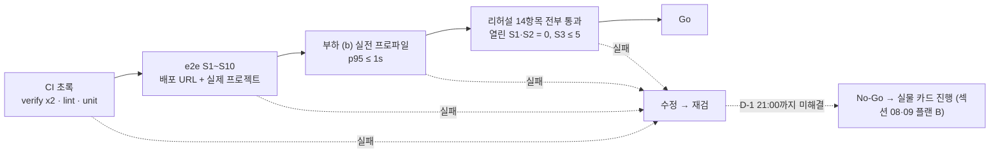

## 10. 테스트 계획과 수용 기준 매핑

브리프 §6의 수용 기준 7개를 "무엇으로, 어떤 픽스처로, 어떤 문장이 나오면 통과인지"로 고정한다. 자동화할 수 있는 것은 전부 CI에 넣고, 폰·프로젝터가 있어야 하는 것은 리허설 체크리스트로 옮긴다. 엔진 의미론의 검증은 `engine/verify.ts`(ENGINE_SPEC §9)에 맡기고, UI 테스트는 엔진을 다시 검증하지 않는다(브리프 §0-2와 같은 원칙).

### 10.1 층위와 도구

| 층위 | 도구 | 위치 | 명령 | 실행 시점 |
|---|---|---|---|---|
| 엔진 검증 | tsx(외부 러너 없음) | `engine/verify*.ts`, 복사본 `lib/engine/` | `npm run verify`, `npm run verify:lib` | 모든 push |
| 정적 검사 | tsc strict, ESLint `no-restricted-imports`(섹션 01 §1.7 엔진 import 금지) | 전체 | `npm run lint && npx tsc --noEmit` | 모든 push |
| 단위·컴포넌트 | vitest + @testing-library/react + jsdom | `tests/unit/**/*.test.tsx` | `npm test` | 모든 push |
| 실시간 통합 | Playwright(≥1.45) 다중 컨텍스트 + 로컬 Supabase | `tests/e2e/*.spec.ts` | `npm run test:e2e` | main 머지, 수동 트리거 |
| 시각 스냅샷 | Playwright `toHaveScreenshot` | `tests/e2e/board.spec.ts` | `npm run test:e2e -- board` | 보드 변경 시 |
| 부하 | Node 스크립트 | `scripts/load.ts` | `npm run test:load` | 실제 프로젝트에 D-7, D-1 |
| 리허설 | 실제 폰 4대 + 프로젝터 | §10.9 체크리스트 | — | D-7, D-1 |

**[결정]** 테스트 훅 규약. 섹션 05·06의 컴포넌트가 아래 `data-testid`를 붙인다: `block-counter`(속성 `data-over="true|false"`), `submit-button`, `palette-<blockId>`(비활성은 `aria-disabled="true"`), `stack-block-<uid>`, `cursor`, `sealed-overlay`, `toast`, `code-line-<n>`(현재 줄은 `aria-current="step"`), `board-tick`(속성 `data-tick`), `owl`(속성 `data-cell="x,y"`), `phase-badge`.
**[결정]** `package.json`에 `test`, `test:e2e`, `test:load`, `fixtures` 스크립트를 추가한다(섹션 01 §1.9의 목록에 더함).

### 10.2 수용 기준 7개 매핑

| # | 기준(브리프 §6) | 방법 | 픽스처 | 통과 판정 문장 | 담당 화면 |
|---|---|---|---|---|---|
| 1 | verify 전부 통과 | 자동(CI) | 없음 | `npx tsx lib/engine/verify.ts`가 `N/N passed`를 출력하고 exit 0. `npm run sync:engine` 직후 `git diff --exit-code lib/engine`에 변경 없음 | — |
| 2 | 폰 4대 · 역할 팔레트 · 1초 반영 | 자동(e2e S1) + 수동(리허설 4) | 게임 1, 팀 1, 역할 4 컨텍스트 | 각 컨텍스트의 `palette-*` 집합이 `ROLES[role].blocks`와 정확히 일치. A가 삽입한 블록이 B·C·D의 `stack-block-<uid>`로 나타나기까지 20회 반복 p95 ≤ 1000ms, 최대 2000ms | `/play` |
| 3 | 상한 초과 · 제출 버튼 | 자동(단위 + e2e S5) | R3 맵(cap 7), 8블록 doc | `block-counter` 텍스트 `8/7`, `data-over="true"`, architect의 `submit-button`이 `disabled`. runner·turner·controller 컨텍스트에서는 `submit-button`이 DOM에 없음 | `/play` |
| 4 | R3 정답 → 20틱 · 쥐 2 · 150점 | 자동(verify §9-5 + e2e S9) + 수동(리허설 9) | 팀 A가 `[forward]`를 먼저 제출, 팀 B는 `SOLUTIONS.r3[0]` | 팀 B `results` = `outcome 'goal', ticks 20, mice 2, score 150`. 보드 `board-tick`이 20에서 멈추고 점수 팝이 "둥지 도착 +100 / 쥐 2마리 +40 / 코드 골프 +10"만 표시 | `/host`, `/board` |
| 5 | R5 사망 18틱 → 패치 → 37틱 135점 | 자동(verify + e2e S6) + 수동(리허설 10) | 팀 A 먼저 제출, 팀 B는 `r5.noSleep` | 1차 `results`: `'dead', ticks 18, trace[18].owl = {x:7,y:4}, message "고양이를 밟았다", score 0`. "패치 허용" → 잠자기 삽입 → 재제출 → "재실행" 후 `'goal', ticks 37, used_patch true, score 135`, `score_lines`에 `패치권 사용 −10` | `/host`, `/play`, `/board` |
| 6 | 보드 코드 텍스트 + 줄 하이라이트 | 자동(단위 CodePanel + 스냅샷) | trace 픽스처 `r3-goal-20` | 틱 k(1~20)에서 `aria-current="step"`인 `code-line-*`이 정확히 1개이고 그 번호 = `trace[k].line`. 머리 줄(`반복 4 {` 등)과 닫는 줄은 어느 틱에도 하이라이트되지 않음 | `/board` |
| 7 | 5라운드 → 최종 순위 | 자동(e2e S10) + 수동(리허설 12) | `five-rounds.json`(팀 2, 라운드별 doc) | R5 `scored`에서 "다음 라운드" 대신 "최종 순위" 버튼이 보이고, 누르면 `games.phase='finished'`, 보드 `Scoreboard`에 1~N위와 누적 점수. 동점은 DECISIONS §F 순서 | `/host`, `/board` |

**[결정]** 기준 4·5의 검증값 150·135는 `firstSubmit=false` 기준이다(ENGINE_SPEC §7). 자동·수동 테스트 모두 더미 팀이 먼저 제출해 대상 팀이 "최초 제출 +10"을 받지 않게 한다. 대상 팀만 제출한 경우 160·145가 나오며, 점수 줄에 `최초 제출 +10`이 있을 때만 통과로 인정한다.
**[결정]** 기준 5의 잠자기 삽입 위치는 `solutions[0]`과 `noSleep`을 깊이 비교해 첫 차이의 AST 경로로 구한다(`tests/e2e/util/diffPath.ts`). 섹션 07에 별도 export를 요구하지 않는다.

### 10.3 엔진 검증과 CI

`npm run verify`는 `engine/verify.ts`가 `verify-core.ts`(§9-1~4)와 `verify-rounds.ts`(§9-5)의 `Check[]`를 모아 `✓/✗` 목록을 출력하고 하나라도 실패하면 exit 1이다. 오늘 기준 core 117개이고, rounds는 섹션 07의 `rounds/r1~r5.ts`·`maps.ts`·`solutions.ts` 작성 후 채워진다(현재 빈 배열).

| 묶음 | 검사 내용 요약 | 개수 |
|---|---|---|
| §9-1 단위 의미론 | 회전표, forward/jump의 벽·맵 밖·구덩이·문(열쇠 유무·소모·중간 칸 규칙), if_wall 6조건·if_pit 4조건, repeat·중첩, def/call 0틱과 `Step.line`이 def 본문 줄, sleep, 고양이 loop/pingpong/길이 1, "밟았다"/"잡혔다", 둥지 틱 고양이 정지, maxTicks 300·옵션, stuck 거리, 컴파일 에러 3종, `trace[i].tick === i`, `ticks === trace.length − 1` | 65 |
| §9-2 countBlocks · validate | 예시 5, 빈 0, 8개 코드(변형 포함), 전부 보고·표 순서, 문구 수 = 코드 수 | 20 |
| §9-3 toText · lineIndex | 스펙 예시 15줄 동일, 머리/닫는 줄 path, depth, 빈 입, `} 아니면 {` 항상 출력 | 12 |
| §9-4 score | 150·135, goal 줄 순서·생략 규칙, stuck/error 40−5d, dead 0·바닥 0 | 14 |
| checkMap + 공통 불변식 | S/G 개수·행 길이·타일 문자·고양이 path 연속성, 종료 틱 event 존재, 최종 owl == 마지막 Step | 6 |
| §9-5 라운드(예정) | 5개 맵 구조 제약, 정답별 `expect` 일치, 브리프 기준 4·5 재현(20/2/150, 18틱 (7,4), 37/135) | 섹션 07 |

**[결정]** CI는 verify를 원본과 복사본에서 두 번 돌리고, 그 사이에 `sync:engine` 후 diff가 0인지 확인한다. e2e 잡은 Docker 기반 로컬 Supabase를 쓰고, 스키마는 `supabase db reset` 대신 `psql`로 `supabase/schema.sql`·`rpc.sql`을 직접 적용한다(섹션 01 §1.6의 파일 배치 유지).

```yaml
# .github/workflows/ci.yml
name: ci
on: [push, pull_request, workflow_dispatch]
jobs:
  verify:
    runs-on: ubuntu-latest
    steps:
      - uses: actions/checkout@v4
      - uses: actions/setup-node@v4
        with: { node-version: 20, cache: npm }
      - run: npm ci
      - run: npm run verify                                   # 원본 engine/
      - run: npm run sync:engine && git diff --exit-code lib/engine
      - run: npm run verify:lib                               # 복사본 = 수용 기준 1
      - run: npm run fixtures && git diff --exit-code tests/fixtures
      - run: npm run lint && npx tsc --noEmit
      - run: npm test -- --run
  e2e:
    if: github.ref == 'refs/heads/main' || github.event_name == 'workflow_dispatch'
    needs: verify
    runs-on: ubuntu-latest
    steps:
      - uses: actions/checkout@v4
      - uses: actions/setup-node@v4
        with: { node-version: 20, cache: npm }
      - uses: supabase/setup-cli@v1
      - run: supabase start
      - run: psql "$(supabase status -o json | jq -r .DB_URL)" -f supabase/schema.sql -f supabase/rpc.sql
      - run: |
          echo "NEXT_PUBLIC_SUPABASE_URL=http://127.0.0.1:54321" >> $GITHUB_ENV
          echo "NEXT_PUBLIC_SUPABASE_ANON_KEY=$(supabase status -o json | jq -r .ANON_KEY)" >> $GITHUB_ENV
      - run: npm ci && npx playwright install --with-deps chromium webkit
      - run: npm run test:e2e                                 # playwright.config의 webServer가 next build && next start
```

### 10.4 컴포넌트/훅 테스트 (vitest + testing-library)

환경: `environment: 'jsdom'`, `setupFiles: tests/setup.ts`(`@testing-library/jest-dom`, zustand 스토어 리셋, `vi.mock('@/lib/supabase/client')`). 엔진은 mock하지 않고 `lib/engine/`을 그대로 쓴다. 픽스처 doc: 스펙 §5 예시(15줄, 5블록), R3 정답, 8블록 초과 doc.

| 파일 | 대상 | 케이스 → 기대 |
|---|---|---|
| `useProgram.test.ts` | `insert(block)` | 커서 위치에 삽입, 로컬 `version+1`, 커서는 새 블록 뒤(C-블록이면 그 첫 입 안). `def`는 최상위 커서에서만 |
| | `remove(path)` | C-블록은 안까지 삭제. 3초 안 `undo()`가 삭제 전 스냅샷 복원 + `version+1` + 저장 |
| | `move(from, to)` | 같은 입·다른 입 이동, C-블록을 자기 입 안으로 이동은 무시 |
| | `setRepeatN(path, n)` | 1~9만 반영 |
| | `applyRemote(doc, version)` | `version > local`이면 교체, 아니면 무시. 교체 후 커서 경로가 없으면 최상위 끝 |
| | `save` | 150ms 디바운스로 1회 UPDATE. 영향 행 0 → 재조회 + 토스트 "다른 팀원이 먼저 저장했어요" |
| `cursor.test.tsx` | `ProgramStack` 탭 규칙(DECISIONS §G) | 블록 탭 → 그 뒤 · C-블록 머리 탭 → 첫 입 맨 앞 · 빈 입/`아니면` 줄 탭 → 그 입 끝 · 빈 스택 탭 → 최상위 끝 · `cursor` 요소가 항상 1개 |
| `palette.test.tsx` | `Palette` 활성 규칙 | 역할 4개 각각 `palette-*` = `ROLES[role].blocks` · `def`는 최상위 커서에서만, 이미 있으면 비활성 · `call`은 `def` 없으면 비활성, 커서가 `def` 안이면 비활성 · `phase !== 'coding'` 또는 봉인이면 팔레트 미렌더 |
| `counter.test.tsx` | `block-counter` | 5블록 doc → `5/7`, `data-over="false"` · 8블록 → `8/7`, `data-over="true"` · `countBlocks` spy가 호출됨(UI가 직접 세지 않음) |
| `submit.test.tsx` | 제출 버튼 | architect만 렌더 · `validate.ok=false`(E_CAP·E_EMPTY·E_CALL_NO_DEF) → `disabled` + 첫 에러 문구 · ok → 활성 · 클릭 → 시트 "봉인하면 수정 불가" → 확인 시 `submit_program` rpc 1회 → `sealed-overlay` |
| `CodePanel.test.tsx` | `toText` 렌더·하이라이트 | 15줄 그대로, 들여쓰기 2칸 유지 · `line=k` → `code-line-k`만 `aria-current` · 픽스처 `r3-goal-20`의 모든 `trace[k].line`이 액션 블록 줄 · `call` 실행 틱은 `def` 본문 줄 |
| `usePlayback.test.ts` | 재생 훅 | fake timers로 틱 600ms · 마지막 프레임 유지 · `ticks×600 + 2000ms` 후 `done` · 중간 진입(새로고침) 시 마지막 프레임 즉시 |
| `useTimer.test.ts` | 타이머 | 서버 오프셋 적용 · 0:00에서 멈춤 · `/play`는 전이 호출 0회, `/host`만 `sealed` 전이 1회 |
| `useGameChannel.test.ts` | 재연결 | `CLOSED` → 1s·2s·4s·8s 재구독 → `loadGameSnapshot` 1회 |
| `join.test.tsx` | 참가 | 찬 역할 비활성 · unique 충돌 → "방금 다른 사람이 골랐어요" · localStorage 복귀 |

### 10.5 실시간 통합 테스트 (Playwright 다중 컨텍스트)

- 환경: 로컬 Supabase(`supabase start`) 또는 Docker가 없으면 별도 테스트 프로젝트(`.env.test`). 테스트는 `/host`에서 게임을 만들고 끝나면 `games` 행을 삭제한다(cascade).
- 컨텍스트 6개: 진행자(1440×900), 보드(1920×1080), 폰 4개(`devices['iPhone 13']`, 역할별 1개). 전부 같은 머신이라 `Date.now()`를 그대로 비교한다.

```ts
// tests/e2e/sync.spec.ts 개요
const code = await createGame(host, { teams: 2 });          // "게임 만들기" → 4자리 코드
const phones = await Promise.all(ROLES.map(() => browser.newContext({ ...devices['iPhone 13'] })));
await Promise.all(phones.map((c, i) => join(c, code, 1, ROLES[i])));
await host.getByRole('button', { name: '다음 페이즈' }).click(); // lobby → coding
const t0 = Date.now();
await phones[0].page.getByTestId('palette-forward').tap();
await Promise.all(phones.slice(1).map(c => c.page.getByTestId(/^stack-block-/).first().waitFor()));
latencies.push(Date.now() - t0);                             // 20회 반복 → p95 ≤ 1000
```

| 시나리오 | 조작 | 판정 |
|---|---|---|
| S1 동시 편집 | runner `앞으로`, turner `좌회전`을 `Promise.all`로 동시 탭 | 1초 내 4대 doc 동일(두 블록 모두 포함, 순서 무관), `programs.version` 단조 증가 |
| S2 충돌 | 두 폰이 같은 150ms 창에서 저장 | 한쪽에 `toast` "다른 팀원이 먼저 저장했어요", 최종 doc 4대 동일 |
| S3 커서 소실 | A가 C-블록 삭제, B 커서가 그 입 안 | B의 `cursor`가 최상위 끝으로 이동 |
| S4 재연결 | C `setOffline(true)` 10초, 그동안 A가 3회 편집, 복귀 | ≤10초 내 C doc 일치(백오프 1→8s + 스냅샷). 25초 후 다른 폰에서 C 오프라인 표시, 복귀 후 온라인 |
| S5 상한·제출 | 8블록 → 7블록 → architect 제출 | 기준 3 판정 → 활성 → 3대 `sealed-overlay` ≤1초, 팔레트 미렌더 |
| S6 패치 | 기준 5 전체 흐름 | 팀 B만 잠금 해제, 팀 A는 `sealed-overlay` 유지, 재실행 결과 135 |
| S7 새로고침 | `page.reload()`; localStorage 삭제 후 reload | 같은 역할로 `/play` 복귀·doc 유지; 삭제 후는 `/` |
| S8 탭 조립 | 3역할이 탭만으로 `SOLUTIONS.r3[0]` 조립 | `toText(doc).text`가 스펙 §5 예시 앞 9줄과 동일(커서 규칙의 통합 검증) |
| S9 기준 4 | 팀 B doc를 supabase-js로 직접 세팅 → 봉인 → "전체 실행" | 기준 4 판정 문장 |
| S10 5라운드 완주 | 타이머 대신 "다음 페이즈"로 봉인, `autoplay=true`, 라운드마다 `five-rounds.json` 주입 | 기준 7 판정 문장, 누적 점수 = 라운드 `results.score` 합 |

### 10.6 부하 테스트

- `scripts/load.ts`: supabase-js 클라이언트 30개 = 작성자 24(팀 6 × 역할 4) + 관찰자 6(보드 1·진행자 1·예비 4). 전부 채널 `game:<id>`에 `programs` 필터 `game_id=eq.<id>`로 구독한다. 작성자는 1000ms마다 자기 팀 `programs`를 `version+1`로 UPDATE(doc는 12블록 정답 크기), 5분간.
- 지연 측정: 같은 프로세스이므로 `(team_id, version) → sentAt` 맵을 두고, 각 클라이언트가 UPDATE 이벤트를 받을 때 `Date.now() − sentAt`을 기록한다. 결과는 p50/p95/max, 누락 수(기대 수신 = 30 × 24 × 300), 재연결 횟수, HTTP 오류 수(영향 행 0의 버전 충돌은 정상).
- 합격선: **p95 ≤ 1000ms**, max ≤ 2500ms, 누락 0(30초 내 스냅샷 재조회로 보정된 것 포함), 재연결 ≤ 1회/클라이언트, Supabase 대시보드 Realtime 동시 연결 30.
- 프로파일 2개를 돌린다. (a) 위 최악 프로파일(30 UPDATE/s). (b) 실전 프로파일: 작성자 24가 2~6초 무작위 간격으로 UPDATE(사람 손 속도 + 150ms 디바운스). 실제 플랜에서 (b)는 반드시, (a)는 가능하면 통과한다.
- **[미결]** (a)는 30 UPDATE/s × 수신 30 = 초당 900 메시지 팬아웃이라 Supabase Free의 Realtime 메시지 한도(100/s)에 걸릴 수 있다. D-7 측정에서 p95가 넘으면 두 대안 중 하나를 클럽이 고른다: Pro 플랜으로 행사 기간 승급, 또는 `/play`의 `programs` 바인딩만 `team_id=eq.<teamId>` 필터로 바꿔 팬아웃을 1/6로 줄인다(DECISIONS §D 수정 필요, 섹션 03·11 참조).

### 10.7 보드 재생 시각 검증 (스냅샷)

`scripts/make-fixtures.ts`가 엔진으로 `tests/fixtures/traces/*.json`(`{ map, program, result }`)을 생성하고 커밋한다. CI가 재생성 후 diff 0을 확인하므로 엔진이 바뀌면 픽스처도 함께 갱신된다.

| 픽스처 | 입력 | 기대 |
|---|---|---|
| `r3-goal-20` | `MAPS[3]`, `SOLUTIONS.r3[0]` | goal, 20틱, 쥐 2 |
| `r5-dead-18` | `MAPS[5]`, `r5.noSleep` | dead, 18틱, `trace[18].owl=(7,4)`, "고양이를 밟았다" |
| `timeout-300` | `MAPS[1]`, `[repeat 9 { repeat 9 { repeat 9 { left } } }]`(4블록, 제자리 회전 729틱) | error, event `timeout`, 300틱, trace 301, "시간 초과 (300틱)" |

- 방법: 로컬 DB에 `phase='running'`, `running_team_id`, `results` 행 = 픽스처를 넣고 `page.clock.install()` 후 `/board`를 연다. 틱 k는 `clock.runFor(600×k + 500)`(전환 450ms 종료 후)로 이동해 `toHaveScreenshot('r3-tick-20.png', { maxDiffPixelRatio: 0.005 })`. 뷰포트 1920×1080, `deviceScaleFactor 1`. 스냅샷과 별도로 `board-tick`, `owl[data-cell]`, 현재 `code-line`을 텍스트로 단언한다.
- 캡처 프레임: `r3-goal-20` 틱 0·7·20·20+2000ms(초기 프레임, 중간 하이라이트, 둥지 글로우, 점수 팝 3줄 300ms 간격). `r5-dead-18` 틱 17·18·18+400ms(인접 → (7,4) 겹침 + 흔들림 + 큰 메시지). `timeout-300` 틱 1·300·300+1500ms(회전만, `좌회전` 줄 하이라이트, 결말 메시지).
- **[결정]** 이모지 글꼴이 OS마다 달라 스냅샷은 Linux CI(ubuntu, Noto Color Emoji)에서만 생성·비교한다. 로컬에서는 `--ignore-snapshots`로 텍스트 단언만 돌린다.

### 10.8 기기 매트릭스

| 기기/브라우저 | 뷰포트 | 화면 | 자동(Playwright 프로젝트) | 수동 확인 |
|---|---|---|---|---|
| iOS Safari 17+ (iPhone 12~15) | 390×844 | `/`, `/play` | `phone-webkit` = `devices['iPhone 13']` | 롱프레스 450ms에 텍스트 선택·확대 없음(`-webkit-touch-callout:none`, `user-select:none`) · 드래그 중 당겨서 새로고침 없음(`overscroll-behavior:none`) · 제출 버튼이 홈 인디케이터 위(`env(safe-area-inset-bottom)`) · 화면 잠금 60초 후 복귀 시 재연결·doc 일치 · 백그라운드 탭에서 하트비트 유지 |
| Android Chrome 최신 (Galaxy S/A) | 360×800, 412×915 | `/`, `/play` | `phone-android` = `devices['Pixel 7']` | 360px에서 가로 스크롤·잘림 없음, 팔레트 2열 유지 · 바텀시트에서 뒤로가기가 시트만 닫음 · 100dvh로 주소창 변화에 흔들리지 않음 |
| 데스크톱 Chrome/Edge 최신 | 1440×900 | `/host` | `desktop` = chromium | 팀 6개 표·정답 드로어·이벤트 카드 패널이 스크롤 없이 보임 |
| 데스크톱 Chrome | 1920×1080 F11 | `/board` | `desktop` | 프로젝터 실제 해상도 확인(1920×1080이 아니면 브라우저 배율 100% + 레이아웃 `transform: scale`) · 뒷줄에서 코드 패널 글자 판독(≥28px) |

**[결정]** 팀 화면 기준은 390px이지만 360px에서도 가로 스크롤과 잘림이 없어야 한다(Galaxy 기본 폭). 그 외 폭은 브리프 §5대로 신경 쓰지 않는다. 섹션 01 §1.8의 지원 범위(iOS 16+)는 유지하되 검증 매트릭스는 17+로 한정한다. viewport meta는 `width=device-width, initial-scale=1, viewport-fit=cover`.

### 10.9 리허설 프로토콜

전제: 실제 배포 URL, 실제 Supabase 프로젝트, 폰 4대(iOS 2·Android 2 권장), 진행자 노트북, 프로젝터, 행사장 Wi-Fi. D-7(전체)·D-1(재확인) 2회, 약 40분. 결과는 `docs/rehearsal-<날짜>.md`에 항목별 통과/실패·기기·비고로 남긴다.

| # | 단계 | 조작 | 통과 기준 |
|---|---|---|---|
| 1 | 준비 | 4대 `/` 접속, 보드 F11 | 4대 로드 ≤5초, 보드 로비에 게임 코드 |
| 2 | 참가 | 코드 → 팀 → 역할 | 찬 역할 비활성, 보드 접속 인원 4/4 ≤1초 |
| 3 | 코딩 시작 | "다음 페이즈" | 4대 타이머 동일(±1초), 보드에 맵·타이머 |
| 4 | 기준 2 | runner가 `앞으로` 탭 | 나머지 3대 반영 ≤1초(폰 2대를 나란히 슬로모션 촬영해 확인) |
| 5 | 편집 | 롱프레스 삭제 → 되돌리기, 반복 N 피커, 드래그 이동, 남의 블록 삭제 | 각 동작 후 4대 스택 일치 |
| 6 | 기준 3 | 상한+1 블록 | 카운터 빨강·제출 비활성, 비architect에 버튼 없음 |
| 7 | 타이머 | "+30초", 일시정지/재개, 만료 대기 | 4대 동기, 0:00에 진행자 화면이 `sealed` 전이, 미제출 팀 자동 제출 |
| 8 | 실행 R1 | "전체 실행" | 보드 재생·줄 하이라이트·토스트, 자동으로 다음 팀 |
| 9 | 기준 4 | R3, 정답 보기로 확인하며 `SOLUTIONS.r3[0]` 조립 | 20틱·쥐 2·150(유일 제출이면 160) |
| 10 | 기준 5 | R5 잠자기 없이 → "패치 허용" → 잠자기 → 재제출 → "재실행" | 18틱 (7,4) 사망 0점 → 37틱 135(유일 제출이면 145) |
| 11 | 점수 확정 | 이벤트 카드 수동 점수 입력, "점수판 확정" | 보드 순위 반영, `score_lines`에 이벤트 줄 |
| 12 | 기준 7 | R2·R4는 "다음 페이즈"로 빠르게 | `finished` 최종 순위 |
| 13 | 장애 훈련(섹션 09) | running 중 진행자 새로고침, 폰 1대 비행기 모드 30초, 보드 새로고침, 팀원 행 삭제 후 재참가 | 각각 3초 내 복구, 데이터 손실 없음 |
| 14 | 정리 | 리허설 게임 삭제 | 실제 게임 코드와 충돌 없음 |

### 10.10 결함 심각도와 Go/No-Go

| 등급 | 정의 | 예 | 처리 |
|---|---|---|---|
| S1 치명 | 게임을 진행할 수 없거나 결과가 틀림 | 실행 결과·점수가 verify 기대와 다름, 제출 불가, 페이즈 전이 불가, 보드 재생 안 됨, doc 유실 | 행사 전 반드시 수정. 미수정이면 No-Go |
| S2 심각 | 진행은 되나 진행자 개입 필요 | 동기화 지연 >3초 또는 불일치 잔존, 재연결 실패(새로고침으로만 복구), 패치 흐름 오류, 타이머 어긋남 >2초 | 수정 또는 섹션 08 런북에 우회 절차 명시. 열린 S2 0개가 Go 조건 |
| S3 보통 | 특정 기기·상황의 UI 결함 | 360px 잘림, 토스트 겹침, 애니메이션 끊김 | 여유 있으면 수정. 열린 S3 ≤ 5 |
| S4 경미 | 문구·색·간격 | 라벨 오타, 글로우 세기 | 행사 후 |



- **[결정]** Go/No-Go 판정은 D-1 21:00에 진행자와 개발 담당이 함께 내린다. D-2 이후는 코드 프리즈: S1·S2 수정만 허용하고, 수정마다 CI 전체 + 리허설 1~8(스모크)을 다시 돌린다.
- **[미결]** 플랜 B(실물 카드 + 진행자 수동 실행)의 준비 범위와 인쇄 여부는 클럽이 정한다. `cards.html` 인쇄 규격이 있으므로 비용은 인쇄비뿐이다.
