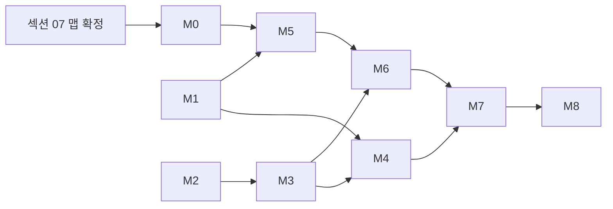
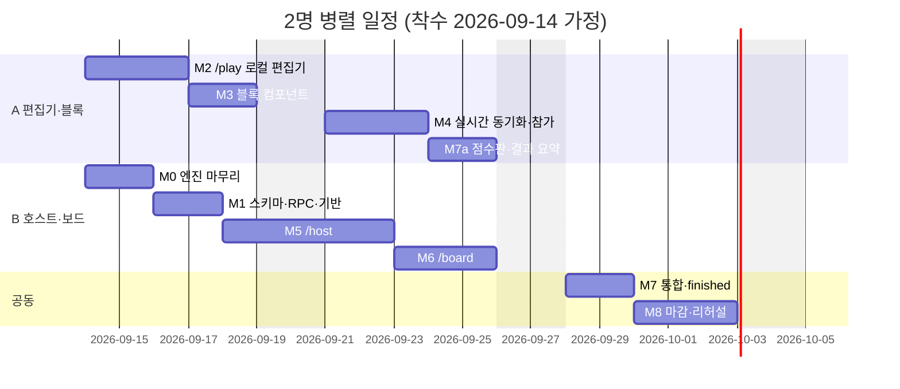

## 11. 개발 순서, 일정, 위험, 미결 사항

브리프 §8의 한 줄 개발 순서를 마일스톤 9개로 펼치고, 인원별 일정·위험·범위 조절 기준·클럽이 결정해야 할 항목을 한곳에 모은다. 수용 기준 번호(AC1~7)는 브리프 §6, 테스트 절차는 섹션 10, 파일 경로는 섹션 01 §1.6의 폴더 구조를 따른다.

### 11.1 마일스톤

전제: 저장소의 `engine/`은 핵심 모듈(types·blocks·text·validate·run·score)과 `verify-core.ts`가 이미 있고 `npm run verify`가 132건 통과한다. `rounds/r1~r5.ts`·`maps.ts`·`solutions.ts`·`verify-rounds.ts`는 비어 있으며 섹션 07(맵)과 함께 M0에서 채운다. 공수는 개발자 1명이 하루 6시간 집중 작업하는 기준의 근무일이다.

| M | 이름 | 산출물(파일) | 완료 판정 | 공수 | 선행 |
|---|---|---|---|---|---|
| M0 | 엔진 마무리·복사 | `engine/rounds/r1~r5.ts`, `maps.ts`, `solutions.ts`, `verify-rounds.ts` 채움, `scripts/sync-engine.mjs`, `lib/engine/` 복사본 | `npm run verify`와 `npx tsx lib/engine/verify.ts` 전부 통과(AC1). verify 안에서 R3 20틱·쥐 2·150점, R5 `noSleep` 18틱 (7,4) 사망·정답 37틱 135점 재현(AC4·5의 엔진 부분) | 2일 | 섹션 07 맵 확정 |
| M1 | 스키마·RPC·클라이언트 기반 | `supabase/schema.sql`, `rpc.sql`, `lib/supabase/{client,types,queries,mutations}.ts`, `lib/hooks/{useGameChannel,useServerClock}.ts`, `.env.local.example`, Supabase 프로젝트(ap-northeast-2) | 섹션 01 §1.9 체크리스트 1~6 완료. `submit_program`을 같은 팀에 동시 2회 호출해 `submit_order`가 1개만 생기고 두 번째 호출은 같은 행을 반환. `members` DELETE 이벤트가 `game_id` 필터로 수신됨(replica identity full). 채널 강제 종료 후 8초 내 재구독+스냅샷 재조회 | 2일 | 없음 |
| M2 | `/play` 로컬 편집기 | `lib/store/program.ts`(커서 모델·삽입·삭제·이동·반복 N), `app/play/page.tsx` 5구역 뼈대(390px), 개발용 `?role=` 가장, `countBlocks`·`validate` 연결 | DECISIONS §G 커서 규칙 6가지(블록 뒤·C-블록 머리·빈 입·아니면 줄·빈 곳·삽입 후) 수동 체크 통과. `n/cap` 초과 시 빨강+제출 비활성(AC3의 로컬 부분). 롱프레스 450ms 삭제+3초 되돌리기. `def`/`call` 팔레트 비활성 규칙 | 2.5일 | 엔진 core(있음) |
| M3 | 블록 컴포넌트 | `components/blocks/{BlockCard,CBlock,Palette,ProgramStack,Cursor,RepeatPicker}`, `components/map/{MapGrid,TileCell,OwlSprite,CatSprite}`, `app/globals.css` 토큰+`.blk/.cblk/.mouth/.else/.foot` 이식 | `cards.html` 히어로(R3 정답)를 `ProgramStack`으로 렌더해 원본과 나란히 비교. 폰 `--blk-h 44px`·폰트 17px·폭 100%. `MapGrid`가 9종 타일을 브리프 §2 표대로 렌더 | 2일 | M2 |
| M4 | 실시간 동기화·참가 | `app/page.tsx`, `lib/store/{session,game}.ts`, `lib/hooks/{useHeartbeat,useTimer}.ts`, 저장 디바운스 150ms+version 가드, 제출 확인 시트+"봉인됨" 오버레이, 페이즈별 읽기 전용, 팀원 접속 표시 | AC2(폰 4대, 1초 내 반영), AC3(제출 버튼은 architect만). 충돌 시 "다른 팀원이 먼저 저장했어요" 토스트 후 서버본 교체. `last_seen` 25초 경과 시 오프라인 표시. 새로고침 후 3초 내 복귀 | 3일 | M1, M3 |
| M5 | `/host` 페이즈 제어·실행 | `app/host/page.tsx`, `components/host/{GamePanel,RoundPanel,TimerControls,TeamTable,SolutionsDrawer}`, `lib/host/{phases,runRound}.ts` | 보드 없이 5라운드 완주(lobby→…→finished). 타이머 만료 시 `sealed` 자동 전이+미제출 팀 자동 제출. `results` 행이 AC4(150)·AC5(0 → 패치 후 135, `used_patch=true`)와 일치. "이전 페이즈로"로 `running→sealed` 시 그 라운드 `results` 삭제 | 3일 | M0, M1 |
| M6 | `/board` 재생 | `app/board/page.tsx`, `components/board/{LobbyView,Playback,CodePanel,EventToast}`, `lib/hooks/usePlayback.ts` | AC4(20틱째 둥지 글로우·쥐 2), AC5(18틱째 (7,4) "고양이를 밟았다"+흔들림), AC6(코드 텍스트+실행 줄 하이라이트). 새로고침 후 마지막 프레임 즉시 복원. 300틱 재생의 누적 드리프트 1틱 미만 | 3일 | M3, M5 |
| M7 | 점수판·finished | `components/board/Scoreboard`, `components/host/EventCardPanel`(수동 점수 입력), 동점 규칙, `/play` 결과 요약, 최종 순위 | AC7. 동점 3종(누적 동점→도착 라운드 수→총 틱→공동 순위) 표시. 이벤트 카드 수동 점수가 `score_lines`에 `{label:'이벤트: …', points}`로 남음 | 1.5일 | M4, M5, M6 |
| M8 | 마감 다듬기·리허설 | ESLint `no-restricted-imports`, `/board?lite=1`, iOS Safari 롱프레스 콜아웃 억제, 오류 토스트, 섹션 10 테스트 전체 실행, 리허설 2회 | AC1~7 전부 통과 + 섹션 08 리허설 체크리스트 통과. 남은 결함이 0건이거나 전부 "행사 영향 없음"으로 분류됨 | 3일 | M7 |

합계 22 근무일(1명 기준). 의존 관계:

- M2는 M0을 기다리지 않는다. `countBlocks`·`validate`·`BLOCKS`·`ROLES`는 이미 있고, `MAPS`가 생기기 전까지 상한은 임시 상수 `12`로 둔다(M4에서 `MAPS[round].cap`으로 교체).
- **[결정]** `useGameChannel`·`useServerClock`은 브리프 순서상 실시간 동기화(M4)에 속하지만 M1로 당긴다. 진행자·보드도 같은 훅을 쓰므로 2명 분담 시 B가 M5를 시작하기 전에 있어야 한다.

### 11.2 일정과 분담

| 인원 | 순서 | 근무일 | 비고 |
|---|---|---|---|
| 1명 | M0→M1→M2→M3→M4→M5→M6→M7→M8 | 22일(약 4.5주) | 리허설 2회는 M8 안 |
| 2명 | A: M2→M3→M4→M7a / B: M0→M1→M5→M6 / 공동: M7 통합→M8 | 15일(3주) | 아래 gantt |

| 담당 | 소유 경로 | 상대에게 넘기는 것(기한) |
|---|---|---|
| A 편집기·블록 | `app/page.tsx`, `app/play/`, `components/blocks/`, `components/map/`, `components/ui/`, `lib/store/{session,program}.ts`, `lib/hooks/{useHeartbeat,useTimer}.ts` | `MapGrid` props `{map, owl, cat, opened, eaten, taken, cell}`(M6 착수 전 9/22) · `Scoreboard`(M7 통합 전 9/25) |
| B 호스트·보드 | `engine/rounds/`, `supabase/`, `lib/supabase/`, `lib/hooks/{useGameChannel,useServerClock,usePlayback}.ts`, `lib/host/`, `lib/store/game.ts`, `app/host/`, `app/board/`, `components/host/`, `components/board/` | `schema.sql`·`Database` 타입·`useGameChannel(gameId)`(M4 착수 전 9/17) · `results` 행 fixture 6개(M7a용, 9/23) |

- **[결정]** 착수 첫날 1시간에 아래 계약을 고정하고 이후 변경은 양쪽 합의로만 한다. (1) 프로그램 문서 타입은 엔진 `Block[]` 그대로, (2) 컬럼명은 섹션 03의 `schema.sql`, (3) `useGameChannel(gameId): void` — 스토어를 채우기만 하고 값을 반환하지 않는다, (4) `MapGrid` props, (5) `results` 행 모양(섹션 03).
- 통합 지점은 세 번이다. 9/17(A가 B의 클라이언트 기반 위에서 M4 착수), 9/22(B가 A의 `MapGrid`로 M6 착수), 9/28(M7 통합). 각 지점에서 Vercel Preview URL로 폰 2대+노트북 스모크 테스트(섹션 10)를 한다.
- 리허설은 행사일(미결 1)에 종속된다. 권고: 운영진 리허설 D-7(폰 8대·2팀·전 라운드), 현장 리허설 D-1(실제 프로젝터·네트워크·R1 1회).

### 11.3 위험 목록

영향·확률은 상/중/하.

| # | 위험 | 영향 | 확률 | 완화책 | 관련 |
|---|---|---|---|---|---|
| 1 | 행사장 와이파이 불안정·포화 | 상 | 중 | 폰은 셀룰러를 기본으로 하고 "와이파이 끄고 접속"을 참가 안내와 보드 로비에 표기. 진행자·보드 PC는 유선, 없으면 진행자 폰 핫스팟. `useGameChannel` 재연결 백오프+스냅샷 재조회(DECISIONS §D). D-7 답사에서 폰 3대로 AC2 지연 측정. 최후 수단: 팀이 불러주는 코드를 진행자가 대신 입력(섹션 09) | 08·09 |
| 2 | Supabase 무료 플랜 Realtime 한도 | 상 | 하 | 설계 부하는 동시 연결 30(무료 상한 200). 메시지는 `programs` UPDATE 1건이 26개 클라이언트로 팬아웃되어 6팀 동시 편집 피크에 초당 150건 안팎, 월 200만 건 대비 미미. 초당 메시지 상한은 D-14에 플랜 문서로 재확인하고 D-7 리허설에서 대시보드 Realtime 지표를 본다. 징후가 있으면 Pro 플랜 1개월(월 25달러)로 전환 — 예비비 확보 | 03 |
| 3 | dnd-kit 모바일 드래그 UX | 중 | 상 | 탭-삽입이 기본이라 드래그가 안 돼도 게임은 된다. 드래그 시작은 블록 오른쪽 손잡이(⋮⋮, 44×44px)에서만, PointerSensor 250ms·5px, 손잡이에만 `touch-action:none`(롱프레스 삭제와 충돌 방지, 섹션 05). 그래도 불안하면 레버 1순위로 제거 | 05 |
| 4 | 프로젝터 PC 성능 부족 | 중 | 중 | `transform`·`opacity`만 전환, 틱당 리렌더 1회, 스프라이트에 `will-change`. **[결정]** `/board?lite=1`이면 글로우·흔들림·그라데이션을 끄고 전환 시간을 0ms로 한다. D-7 답사에서 실제 프로젝터로 6팀×300틱 재생 | 06 |
| 5 | 300틱 시간 초과 프로그램의 3분 재생 | 중 | 중 | **[결정]** `ticks > 120`인 결과는 121틱째부터 틱 간격 150ms(4배속)로 재생하고 보드 우상단에 "4배속" 배지를 띄운다. 재생 길이는 `lib/hooks/usePlayback.ts`의 `playbackDuration(ticks)` 하나로 계산하고 진행자 autoplay 대기(DECISIONS §F)도 같은 함수를 쓴다 → 최장 72+27+2 = 101초. 진행자는 `TeamTable`의 ticks를 보고 "다음 팀"으로 끊을 수도 있다 | 04·06 |
| 6 | 팀원 결석·지각 | 중 | 상 | 운영진 예비 2명을 빈 역할로 투입(코드 변경 없음). 지각자는 진행자가 해당 역할 행을 삭제(DECISIONS §I)한 뒤 본인이 재참가. 3명 팀 처리 기준은 미결 3 | 08·09 |
| 7 | 신입생이 규칙을 못 따라옴 | 상 | 중 | 시작 전 5분 브리핑 + 운영진 팀이 별도 게임 코드로 R1을 1회 실행해 보이는 데모(기능 추가 없음). 팀당 규칙 요약 A4 1장(카드 뒷면 문구 재사용). R1은 `+30초`를 아끼지 않는다. 팀마다 운영진 1명이 붙되 답은 주지 않는다 | 08 |
| 8 | 맵·정답 확정 지연(섹션 07 별도 작성) | 상 | 중 | A 트랙은 엔진 core만으로 M4까지 진행 가능. B는 M1을 먼저 하고 M0을 M5 직전까지 미룰 수 있다(최대 4일 여유). 그 뒤로 밀리면 R1·R3·R5만 먼저 확정하고 R2·R4는 M6 중에 채운다 | 07 |
| 9 | iOS Safari 롱프레스 콜아웃·텍스트 선택 | 중 | 상 | 스택 컨테이너에 `-webkit-touch-callout:none; user-select:none`, `contextmenu` 기본 동작 차단. M8에서 iPhone 2대(iOS 16·최신)·Android 2대 실기기 점검 | 05 |
| 10 | 개발 인원 1명·일정 초과 | 상 | 중 | M6 종료 시점(1명 기준 착수 17일째)에 남은 일수를 세어 §11.4 레버를 위에서부터 적용 | 11 |

### 11.4 범위 조절 레버

판단 시점은 M6 종료 시. 남은 근무일이 M7+M8(4.5일)보다 적으면 1번부터 부족분만큼 차례로 뺀다.

| 순서 | 빼는 것 | 절감 | 대체 |
|---|---|---|---|
| 1 | DnD 보조(dnd-kit) | 1.5일 | **[결정]** 커서로 선택한 블록에 "▲ 위로"·"▼ 아래로" 버튼 2개. 같은 입 안에서만 이동, 다른 입으로는 삭제 후 재삽입. `@dnd-kit/*` 의존 제거 |
| 2 | 이벤트 카드 패널 | 0.5일 | `EventCardPanel`의 카드 문구·30초 타이머 UI를 빼고 `TeamTable` 행마다 수동 보정 점수 입력란 1개만 남긴다(DECISIONS §J의 `score_lines` 기록은 유지) |
| 3 | 결말 연출 | 0.5일 | 흔들림·둥지 글로우·점수 팝 대신 마지막 프레임 위에 메시지 카드를 정적으로 1.5초. 재생 길이 상수 2000ms는 그대로 |
| 4 | scored 애니메이션 | 0.3일 | 점수 줄 300ms 순차 팝 없이 즉시 표 |

절대 빼지 않는 것: 실시간 동기화(AC2), 실행·재생(AC4·5·6), 점수 계산과 점수판(AC7), 패치권 흐름(AC5), 타이머 만료 자동 봉인. 이것들이 빠지면 게임이 아니라 슬라이드다.

### 11.5 미결 사항

브리프·DECISIONS·ENGINE_SPEC에는 명시적 [미결] 표기가 없고, 섹션 01이 두 건을 남겼다. 아래는 그 두 건과, 어느 문서도 다루지 않아 클럽이 정해야 하는 항목이다. 기한의 D는 행사일.

| # | 항목 | 출처 | 선택지 | 권고 | 기한 |
|---|---|---|---|---|---|
| 1 | **[미결]** 행사 날짜·장소·리허설 날짜 | 없음 | — | 착수일에서 최소 4주 뒤. 리허설 D-7·D-1 | 착수 전 |
| 2 | **[미결]** 개발 인원과 착수일 | 없음 | 1명 22일 / 2명 15일 | 2명, §11.2 분담 | 착수 전 |
| 3 | **[미결]** 팀 수와 인원 불균형 처리 | 브리프 §3 "팀 수 4~6"만 | (a) 3명 팀에 운영진 투입 (b) 5명 팀은 2명이 폰 1대 공유 (c) 역할 겸임(코드 변경) | (a)+(b). (c)는 안 한다 | D-3 명단 확정 시 |
| 4 | **[미결]** 이벤트 카드 사용 여부·라운드 | DECISIONS §J "진행자 재량" | 안 씀 / R3에 코드 리뷰 1회 / 매 라운드 | R3 코드 리뷰 1회. 핫픽스는 시간이 남을 때만 | D-7 리허설 |
| 5 | **[미결]** 참가 URL 도메인 | 섹션 01 §1.9 | `*.vercel.app` / 커스텀 도메인 | 짧은 프로젝트명의 vercel.app + QR | D-10 인쇄 전 |
| 6 | **[미결]** 프로젝터 PC 분리·유선 인터넷 | 섹션 01 §1.2 | 진행자 노트북 확장 디스플레이 / 별도 PC | 확장 디스플레이 + 유선(없으면 핫스팟) | D-7 답사 |
| 7 | **[미결]** 폰 네트워크 안내 | 없음 | 행사장 와이파이 / 셀룰러 | 셀룰러 기본, 와이파이는 예비 | D-7 답사 |
| 8 | **[미결]** 실물 카드 인쇄 | `cards.html` 인쇄 규격(소프트웨어 범위 밖) | 전체 인쇄 / 규칙 요약 A4만 / 없음 | 규칙 요약 A4 팀당 1장 | D-10 |
| 9 | **[미결]** Supabase·Vercel 계정 소유자, 행사 후 폐기 담당 | 없음 | 개인 / 동아리 공용 | 동아리 공용 계정. D+1에 프로젝트 일시정지·anon key 교체 | 착수 전 |
| 10 | **[미결]** 맵 초안 검토 참여자 | 섹션 07 별도 작성 | 개발자만 / 운영진 3명이 종이로 풀어보기 | 운영진 3명이 R3·R5를 종이로 풀어 난이도 체감 확인 | M0 종료 전 |

### 11.6 행사 후 확장 아이디어

이번 범위가 아니다(브리프 §7, DECISIONS §K). 행사가 끝난 뒤 검토할 후보만 적어 둔다. 맵 에디터: `GameMap` JSON을 8×8 격자에서 직접 편집하고 ENGINE_SPEC §8 제약(S·G 1개, 문≠둥지, 정답 `expect` 일치)을 브라우저에서 즉시 검사하는 `/edit` 화면 — `verify-rounds.ts`의 검사 함수를 그대로 재사용한다. 리플레이: `results.trace`가 이미 저장되므로 `/replay/<gameId>` 읽기 전용 화면에서 `Playback`·`CodePanel`을 재사용해 라운드별 재생을 다시 볼 수 있다 — 저장 정책만 정하면 된다. 교육용 튜토리얼 모드: 진행자 없이 혼자 `/play`에서 블록을 놓고 `run()`을 돌려 보는 연습 모드로, 브리프 §0-3(팀 화면 시뮬레이터 금지)을 행사 밖 모드에서만 완화한다. 세 가지 모두 엔진 변경 없이 화면 추가만으로 가능하다는 점이 이번 아키텍처의 부수 효과다.
